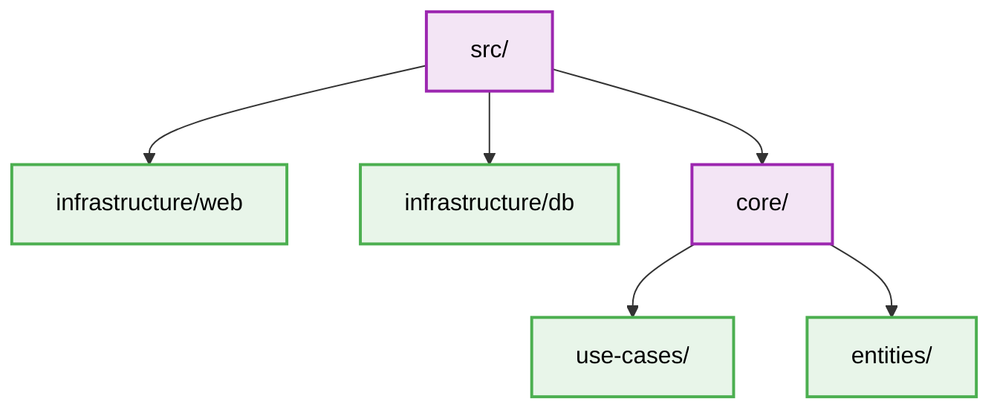

# Clean Architecture - Folder Structure

## Layering publisher/subscriber logic

```mermaid
graph TD
    App[src/] --> Web[infrastructure/web]
    App --> Db[infrastructure/db]
    App --> Core[core/]
    Core --> UseCases[use-cases/]
    Core --> Entities[entities/]
    classDef default fill:#e1f5fe,stroke:#03a9f4,stroke-width:2px,color:#000;
    classDef component fill:#e8f5e9,stroke:#4caf50,stroke-width:2px,color:#000;
    classDef layout fill:#f3e5f5,stroke:#9c27b0,stroke-width:2px,color:#000;

    class App layout;
    class Web component;
    class Db component;
    class Core layout;
    class UseCases component;
    class Entities component;
```

### Constraints
- Inner layers cannot import from outer layers.
