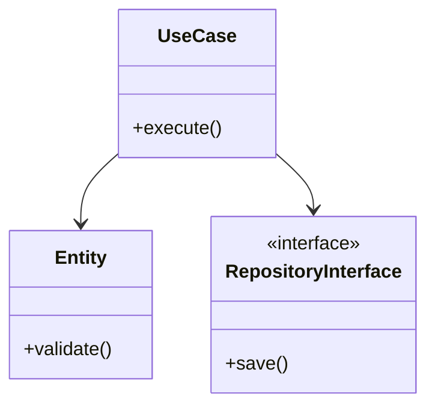

# Clean Architecture - Implementation Guide

## Code patterns and Anti-patterns

### Entity Relationships

### Rules
- Dependency Inversion Principle must be strictly followed.
- Entities encapsulate the most general and high-level rules.
