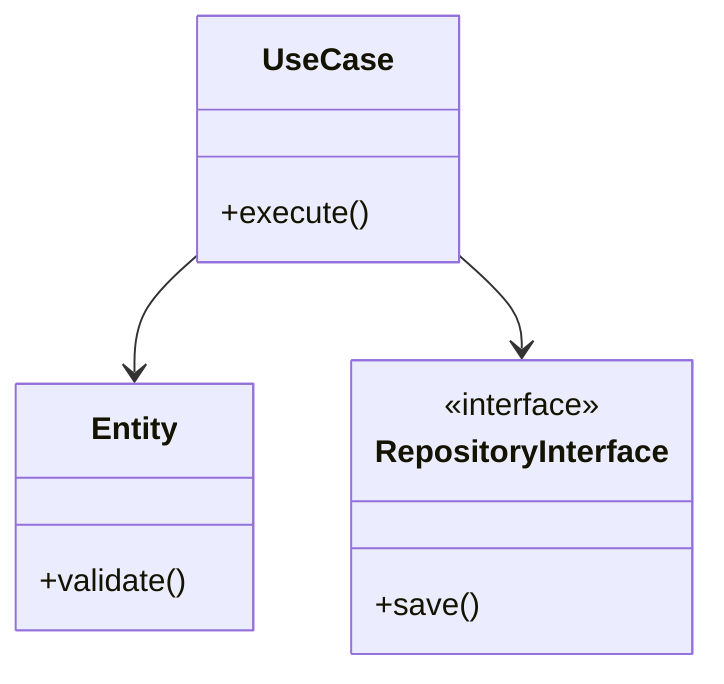

# 🛠️ Clean Architecture Implementation Guide

<div align="center">
  **Executable blueprints and constraints for AI-agent code generation.**
</div>

---
## 💻 Code Patterns and Anti-patterns

### 🧩 Entity Relationships


```mermaid
classDiagram
    class UseCase {
        +execute()
    }
    class Entity {
        +validate()
    }
    class RepositoryInterface {
        <<interface>>
        +save()
    }
    UseCase --> Entity
    UseCase --> RepositoryInterface
```

### Rules
- **Dependency Inversion Principle** must be strictly followed. Dependencies must only point inward toward the core domain.
- **Entities** encapsulate the most general and high-level business rules. They must not depend on any outer layers.

---
## ⚡ The Vibe Coding Instructions (Constraints)

### ❌ Bad Practice
```typescript
import { S3Client } from 'aws-sdk';
import { UserEntity } from '../domain/UserEntity';

export class UploadUserAvatarUseCase {
  constructor(private readonly s3Client: S3Client) {}

  public async execute(user: UserEntity, fileBuffer: Buffer): Promise<string> {
    const uploadResult = await this.s3Client.upload({
      Bucket: 'user-avatars',
      Key: `${user.id}-avatar.png`,
      Body: fileBuffer
    }).promise();

    return uploadResult.Location;
  }
}
```

### ⚠️ Problem
The Use Case (Application layer) depends directly on an external infrastructure dependency (`aws-sdk`). This violates the Dependency Rule. The Use Case cannot be tested without mocking AWS, and changing the storage provider (e.g., to Google Cloud Storage) requires modifying the core business logic.

### ✅ Best Practice
> [!NOTE]
> **Internal Routing:** For more context, refer back to the [Map of Patterns](./readme.md).

```typescript
import { UserEntity } from '../domain/UserEntity';
import { IFileStoragePort } from '../ports/IFileStoragePort';

export class UploadUserAvatarUseCase {
  constructor(private readonly fileStorage: IFileStoragePort) {}

  public async execute(user: UserEntity, fileBuffer: Buffer): Promise<string> {
    const avatarUrl = await this.fileStorage.uploadFile(
      `${user.id}-avatar.png`,
      fileBuffer
    );

    return avatarUrl;
  }
}
```

### 🚀 Solution
By using the **Dependency Inversion Principle**, the Application layer defines an abstract interface (`IFileStoragePort`) that dictates its needs. The Infrastructure layer implements this interface (e.g., `S3FileStorageAdapter`). The Use Case is fully decoupled from the external framework, making it easily testable and agnostic to the storage provider.