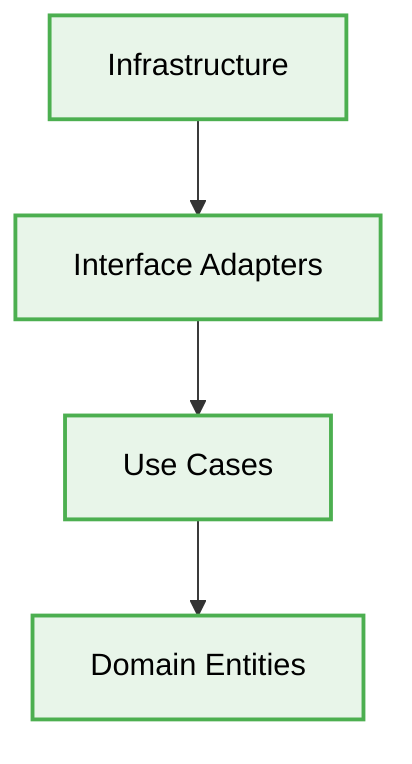

<div align="center">
> [!IMPORTANT]
>   # 🏛️ strictly structured Architecture Production-Ready Best Practices
</div>
---

> [!IMPORTANT]
> This engineering directive defines the **best practices** for strictly structured Architecture. This document is designed to ensure maximum scalability, security, and code quality when developing enterprise-level applications.

# Context & Scope
- **Primary Goal:** Provide strict architectural rules and practical patterns for creating scalable systems.
- > [!IMPORTANT]
  > **Description:** A concept created by Robert C. Martin (Uncle Bob). It separates a project into concentric rings. The main rule is the Dependency Rule: dependencies MUST STRICTLY only point inward.

## Map of Patterns
- 📊 [**Data Flow:** Request and Event Lifecycle](./data-flow.md)
- 📁 [**Folder Structure:** Layering logic](./folder-structure.md)
- ⚖️ [**Trade-offs:** Pros, Cons, and System Constraints](./trade-offs.md)
- 🛠️ [**Implementation Guide:** Code patterns and Anti-patterns](./implementation-guide.md)

## Core Principles

1. **Isolation & Testability:** Changing a single feature doesn't break the entire business process.
2. **Strict Boundaries:** Enforce rigid structural barriers between business logic and infrastructure.
3. **Decoupling:** Decouple how data is stored from how it is queried and displayed.


## Architecture Diagram



---

## 1. ORM Models Bleeding into Domain

### ❌ Bad Practice
```typescript
// Domain Entity directly inherits from TypeORM BaseEntity
import { BaseEntity, Column, Entity } from 'typeorm';

@Entity()
export class User extends BaseEntity {
  @Column()
  email: string;

  public updateEmail(newEmail: string): void {
    this.email = newEmail;
    this.save(); // Hard infrastructure coupling
  }
}
```

### ⚠️ Problem
The Domain layer (the core of the application) is tightly coupled with a specific third-party ORM library (`TypeORM`). This violates the Dependency Rule. Changing the database technology will require rewriting core business logic.

### ✅ Best Practice
```typescript
// Pure Domain Entity completely agnostic of infrastructure
export class User {
  constructor(private readonly id: string, private email: string) {}

  public updateEmail(newEmail: string): void {
    this.email = newEmail;
  }
}

// Infrastructure Layer handles the ORM mapping
@Entity('users')
export class UserTypeOrmEntity {
  @PrimaryColumn()
  id: string;

  @Column()
  email: string;
}
```

### 🚀 Solution
Isolate your Domain models from any external libraries. Use Data Mapper patterns in the Infrastructure layer to map between pure Domain entities and ORM-specific models. This ensures your core business logic is portable and testable without a database connection.

---

## 2. Direct Infrastructure Injection into Use Cases

### ❌ Bad Practice
```typescript
import { S3Client } from 'aws-sdk';

export class UploadAvatarUseCase {
  constructor(private readonly s3Client: S3Client) {}

  public async execute(file: Buffer): Promise<string> {
    // Business logic depends strictly on AWS implementation
    const result = await this.s3Client.upload({ Bucket: 'av', Body: file }).promise();
    return result.Location;
  }
}
```

### ⚠️ Problem
The Use Case (Application layer) depends directly on an external hardware/infrastructure concern (`aws-sdk`). You cannot test this Use Case without mocking AWS S3, and you cannot switch to Azure or Google Cloud without modifying the Use Case.

### ✅ Best Practice
```typescript
// Application Layer defines the abstraction (Port)
export interface IFileStorageService {
  uploadFile(buffer: Buffer): Promise<string>;
}

// Application Layer Use Case depends on the abstraction
export class UploadAvatarUseCase {
  constructor(private readonly storageService: IFileStorageService) {}

  public async execute(file: Buffer): Promise<string> {
    return this.storageService.uploadFile(file);
  }
}
```

### 🚀 Solution
> [!IMPORTANT]
> Apply the Dependency Inversion Principle. The Application layer MUST define abstract interfaces (`Ports`) that dictate what it needs from the outside world. The Infrastructure layer implements these interfaces (`Adapters`). This guarantees true architectural decouple.

---

## 3. Fat Controllers Dictating Business Flow

### ❌ Bad Practice
```typescript
class UserController {
  constructor(private readonly userRepository: IUserRepository) {}

  async registerUser(req: Request, res: Response) {
    const { email, password } = req.body;

    // Controller executing business validation and flow
    const existing = await this.userRepository.findByEmail(email);
    if (existing) {
      return res.status(400).send('Email taken');
    }

    const user = new User(email, hash(password));
    await this.userRepository.save(user);

    return res.status(201).send(user);
  }
}
```

### ⚠️ Problem
The Controller (Interface Adapters layer) contains the business rules. It directly uses the Repository, bypassing the Application Use Case layer. This makes the logic difficult to reuse across different entry points (e.g., CLI, gRPC, HTTP).

### ✅ Best Practice
```typescript
class UserController {
  constructor(private readonly registerUserUseCase: RegisterUserUseCase) {}

  async registerUser(req: Request, res: Response) {
    // Controller solely adapts HTTP into Use Case DTOs
    const result = await this.registerUserUseCase.execute({
      email: req.body.email,
      password: req.body.password
    });

    return res.status(201).send(result);
  }
}
```

### 🚀 Solution
> [!IMPORTANT]
> Controllers MUST be entirely "dumb". Their only responsibility is to parse incoming requests, pass standard DTOs to the corresponding Use Case, and format the output. All branching business logic and validation must reside inside the independent Use Case interactor.
