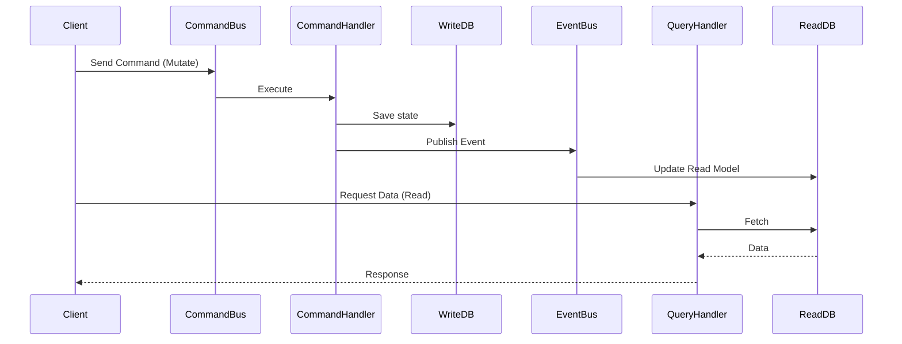

# CQRS - Data Flow

## Request and Event Lifecycle

```mermaid
sequenceDiagram
    participant Client
    participant CommandBus
    participant CommandHandler
    participant WriteDB
    participant EventBus
    participant QueryHandler
    participant ReadDB

    Client->>CommandBus: Send Command (Mutate)
    CommandBus->>CommandHandler: Execute
    CommandHandler->>WriteDB: Save state
    CommandHandler->>EventBus: Publish Event
    EventBus->>ReadDB: Update Read Model
    Client->>QueryHandler: Request Data (Read)
    QueryHandler->>ReadDB: Fetch
    ReadDB-->>QueryHandler: Data
    QueryHandler-->>Client: Response
```

### Constraints
- Strict separation between mutating operations (Commands) and reading operations (Queries).
