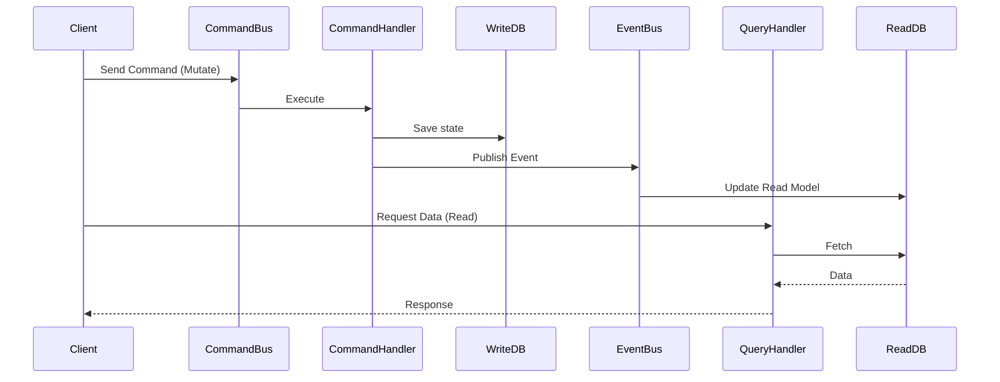

---
description: Vibe coding guidelines and architectural constraints for CQRS within the Architecture domain.
tags: [cqrs, architecture, best-practices, architecture]
topic: CQRS
complexity: Architect
last_evolution: 2026-03-29
vibe_coding_ready: true
technology: CQRS
domain: Architecture
level: Senior/Architect
version: Latest
ai_role: Senior CQRS Expert
last_updated: 2026-03-29---# CQRS - Data Flow
## Request and Event Lifecycle

### Constraints
- Strict separation between mutating operations (Commands) and reading operations (Queries).
