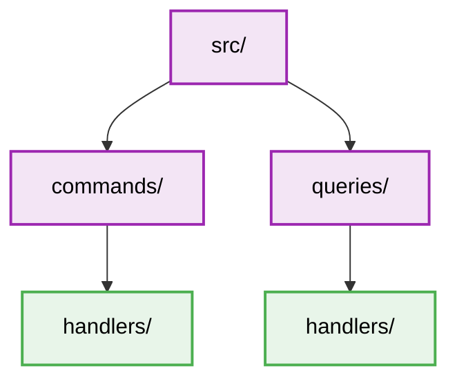

# CQRS - Folder Structure

## Layering publisher/subscriber logic

```mermaid
graph TD
    App[src/] --> Commands[commands/]
    App --> Queries[queries/]
    Commands --> HandlersC[handlers/]
    Queries --> HandlersQ[handlers/]
    classDef default fill:#e1f5fe,stroke:#03a9f4,stroke-width:2px,color:#000;
    classDef component fill:#e8f5e9,stroke:#4caf50,stroke-width:2px,color:#000;
    classDef layout fill:#f3e5f5,stroke:#9c27b0,stroke-width:2px,color:#000;

    class App layout;
    class Commands layout;
    class Queries layout;
    class HandlersC component;
    class HandlersQ component;
```

### Constraints
- Commands and Queries do not share DTOs or models.
