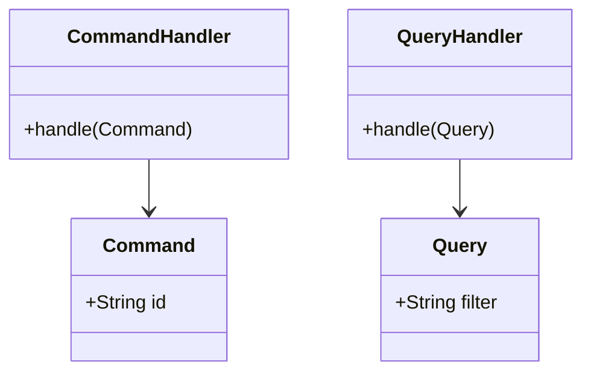

# CQRS - Implementation Guide

## Code patterns and Anti-patterns

### Entity Relationships

### Rules
- Never return business data from a Command (only ack or id).
- Queries must never mutate state.
