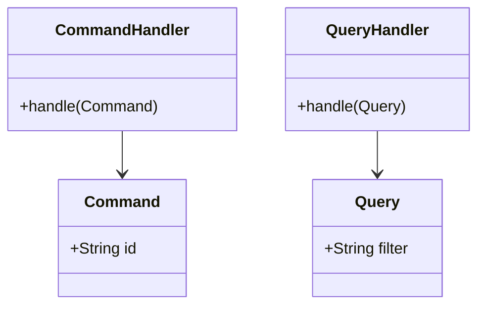

# 🛠️ CQRS Implementation Guide

<div align="center">
  **Executable blueprints and constraints for AI-agent code generation.**
</div>

---
## 💻 Code Patterns and Anti-patterns

### 🧩 Entity Relationships


```mermaid
classDiagram
    class Command {
        +String id
    }
    class Query {
        +String filter
    }
    class CommandHandler {
        +handle(Command)
    }
    class QueryHandler {
        +handle(Query)
    }
    CommandHandler --> Command
    QueryHandler --> Query
```

### Rules
- Never return business data from a Command (only ack or id).
- Queries must never mutate state.

---
## ⚡ The Vibe Coding Instructions (Constraints)

### ❌ Bad Practice
```typescript
import { Database } from '../infrastructure/Database';

export class CreateUserCommandHandler {
    constructor(private readonly db: Database) {}

    async handle(command: CreateUserCommand): Promise<User> {
        // Mutating State
        const user = new User(command.name, command.email);
        await this.db.users.save(user);

        // BAD: Returning full business data from a command
        return user;
    }
}
```

### ⚠️ Problem
Returning the full entity or business data from a Command Handler breaks the fundamental rule of CQS/CQRS: **A method should either change state (Command) or return data (Query), but not both.** Returning data couples the mutation logic with read requirements, making it harder to optimize reads and writes independently, and breaking the single responsibility principle.

### ✅ Best Practice
> [!NOTE]
> **Internal Routing:** For more context, refer back to the [Map of Patterns](./readme.md).

```typescript
import { Database } from '../infrastructure/Database';

export class CreateUserCommandHandler {
    constructor(private readonly db: Database) {}

    async handle(command: CreateUserCommand): Promise<string> {
        // Mutating State
        const user = new User(command.name, command.email);
        await this.db.users.save(user);

        // GOOD: Returning only the ID (or an acknowledgment)
        return user.id;
    }
}
```

### 🚀 Solution
> [!IMPORTANT]
> Strictly separate Commands and Queries. A Command Handler MUST only return a success acknowledgment or the unique identifier of the newly created resource. If the client needs the full entity data, it MUST subsequently issue a separate Query (e.g., `GetUserQuery`) using the returned ID. This ensures independent scaling and maintainability of the read and write models.