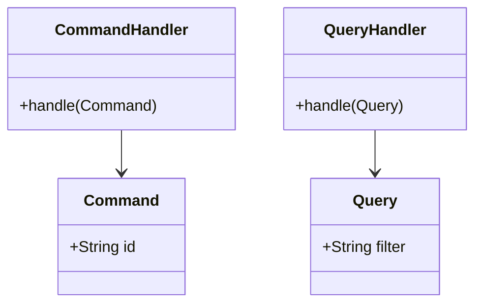

---
description: Vibe coding guidelines and architectural constraints for CQRS within the Architecture domain.
tags: [cqrs, architecture, best-practices, architecture]
topic: CQRS
complexity: Architect
last_evolution: 2026-03-29
vibe_coding_ready: true
technology: CQRS
domain: Architecture
level: Senior/Architect
version: Latest
ai_role: Senior CQRS Expert
last_updated: 2026-03-29---# CQRS - Implementation Guide
## Code patterns and Anti-patterns

### Entity Relationships

```mermaid
classDiagram
    class Command {
        +String id
    }
    class Query {
        +String filter
    }
    class CommandHandler {
        +handle(Command)
    }
    class QueryHandler {
        +handle(Query)
    }
    CommandHandler --> Command
    QueryHandler --> Query
```

### Rules
- Never return business data from a Command (only ack or id).
- Queries must never mutate state.
