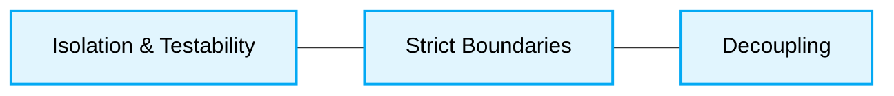
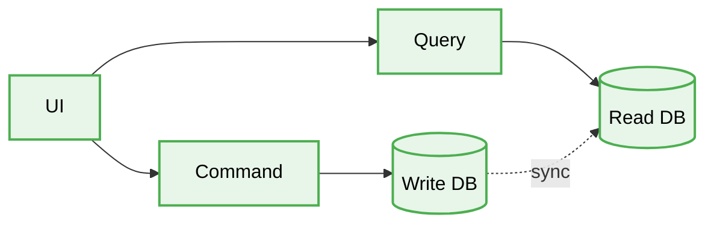

<div align="center">
  # 🏛️ CQRS (Command Query Responsibility Segregation) Production-Ready Best Practices
</div>
---

This engineering directive defines the **best practices** for the CQRS (Command Query Responsibility Segregation) architecture. This document is designed to ensure maximum scalability, security, and code quality when developing enterprise-level applications.
# Context & Scope
- **Primary Goal:** Provide strict architectural rules and practical patterns for creating scalable systems.
- **Description:** A powerful pattern where Commands (actions that mutate system data) are entirely decoupled from Queries (actions that only read data).
## Map of Patterns
- 📊 [**Data Flow:** Request and Event Lifecycle](./data-flow.md)
- 📁 [**Folder Structure:** Layering logic](./folder-structure.md)
- ⚖️ [**Trade-offs:** Pros, Cons, and System Constraints](./trade-offs.md)
- 🛠️ [**Implementation Guide:** Code patterns and Anti-patterns](./implementation-guide.md)
## Core Principles

1. **Isolation & Testability:** Changing a single feature doesn't break the entire business process.
2. **Strict Boundaries:** Enforce rigid structural barriers between business logic and infrastructure.
3. **Decoupling:** Decouple how data is stored from how it is queried and displayed.



## Architecture Diagram



---

## 1. Mixing Reads and Writes in a Monolithic Service

### ❌ Bad Practice
```typescript
class UserService {
  constructor(private readonly db: Database) {}

  async createUser(data: unknown): Promise<void> {
    const user = new User(data);
    await this.db.users.save(user);
  }

  async getActiveUsersWithComplexFilters(filters: unknown): Promise<unknown[]> {
    // Complex query hitting the same DB used for writes
    return this.db.users.find({ active: true, ...filters }).populate('relations');
  }
}
```

### ⚠️ Problem
Combining complex read queries and heavy write operations in a single service and database leads to severe performance bottlenecks. Scaling writes and reads independently is impossible, and the Domain logic for commands becomes entangled with data-shaping logic for queries.

### ✅ Best Practice
```typescript
// --- COMMAND SIDE ---
class CreateUserCommandHandler {
  constructor(private readonly writeDb: WriteDatabase) {}

  async execute(command: CreateUserCommand): Promise<void> {
    const user = User.create(command.data);
    await this.writeDb.users.save(user);
    // Publish event for ReadDB sync
  }
}

// --- QUERY SIDE ---
class GetActiveUsersQueryHandler {
  constructor(private readonly readDb: ReadDatabase) {}

  async execute(query: GetActiveUsersQuery): Promise<unknown[]> {
    // Directly querying an optimized, denormalized read database (e.g., ElasticSearch, Redis)
    return this.readDb.users.find({ active: true, ...query.filters });
  }
}
```

### 🚀 Solution
Strictly segregate Commands (mutations) from Queries (reads). Use separate models and potentially separate databases optimized for each task. Commands encapsulate complex business logic and write to a normalized DB. Queries bypass complex domain models, reading directly from a denormalized, blazing-fast Read DB, allowing deterministic scaling for read-heavy workloads.
