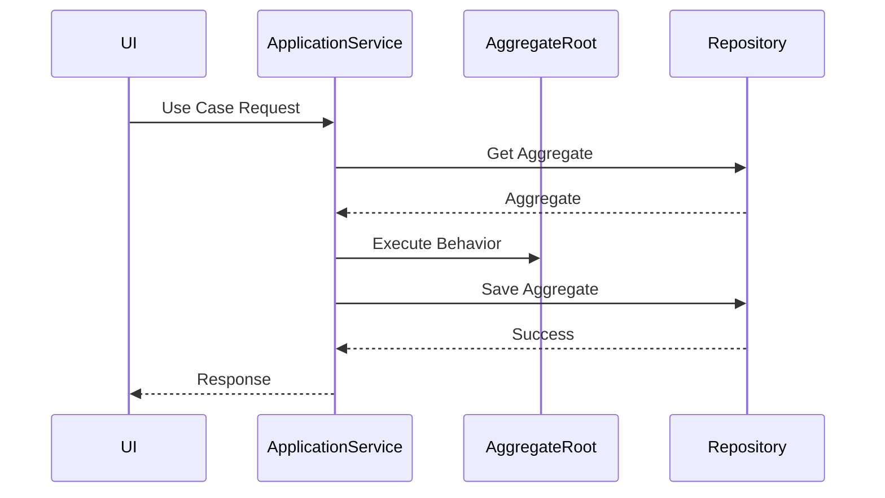

# Domain-Driven Design - Data Flow

## Request and Event Lifecycle

```mermaid
sequenceDiagram
    participant UI
    participant ApplicationService
    participant AggregateRoot
    participant Repository

    UI->>ApplicationService: Use Case Request
    ApplicationService->>Repository: Get Aggregate
    Repository-->>ApplicationService: Aggregate
    ApplicationService->>AggregateRoot: Execute Behavior
    ApplicationService->>Repository: Save Aggregate
    Repository-->>ApplicationService: Success
    ApplicationService-->>UI: Response
```

### Constraints
- State mutation must be coordinated through an Aggregate Root.
