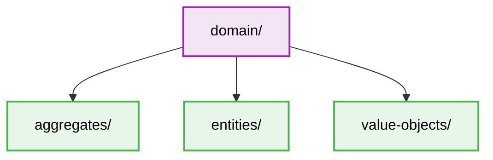

# Domain-Driven Design - Folder Structure

## Layering logic

```mermaid
graph TD
    Domain[domain/] --> Aggregates[aggregates/]
    Domain --> Entities[entities/]
    Domain --> ValueObjects[value-objects/]
    classDef default fill:#e1f5fe,stroke:#03a9f4,stroke-width:2px,color:#000;
    classDef component fill:#e8f5e9,stroke:#4caf50,stroke-width:2px,color:#000;
    classDef layout fill:#f3e5f5,stroke:#9c27b0,stroke-width:2px,color:#000;

    class Domain layout;
    class Aggregates component;
    class Entities component;
    class ValueObjects component;
```

### Constraints
- Value Objects must be immutable.
- Domain layer must not depend on infrastructure.
