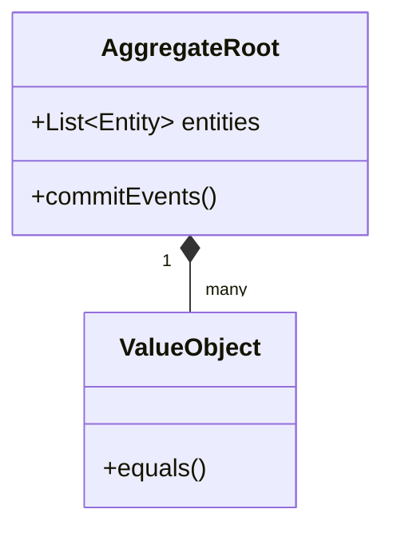

# Domain-Driven Design - Implementation Guide

## Code patterns and Anti-patterns

### Entity Relationships

```mermaid
classDiagram
    class AggregateRoot {
        +List~Entity~ entities
        +commitEvents()
    }
    class ValueObject {
        +equals()
    }
    AggregateRoot "1" *-- "many" ValueObject
```

### Rules
- Ubiquitous language must be strictly used in code.
