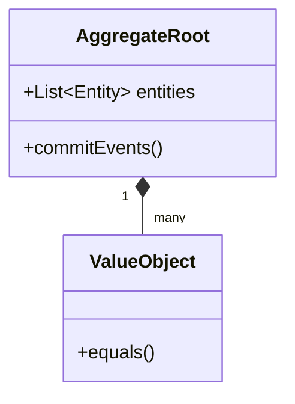

# Domain-Driven Design - Implementation Guide
## Code patterns and Anti-patterns

### Entity Relationships



### Rules
- Ubiquitous language must be strictly used in code.

### 1. Anemic Domain Model

### ❌ Bad Practice
```typescript
class Order {
  public id: string;
  public totalAmount: number;
  public items: OrderItem[];
  public status: string;
}

class OrderService {
  public addDiscount(order: Order, discount: number) {
    if (order.status === 'PENDING') {
      order.totalAmount -= discount;
    }
  }
}
```

### ⚠️ Problem
This is an anemic domain model. The `Order` entity is merely a data holder with public setters, and all the business logic is stripped out and placed in an external `OrderService`. This violates encapsulation, makes the system harder to reason about, and leads to business rules being scattered across multiple services.

### ✅ Best Practice
> [!NOTE]
> **Internal Routing:** For more context, refer back to the [Architecture Map](../readme.md).


```typescript
class Order {
  private id: string;
  private totalAmount: number;
  private items: OrderItem[];
  private status: 'PENDING' | 'PAID' | 'SHIPPED';

  constructor(id: string, items: OrderItem[]) {
    this.id = id;
    this.items = items;
    this.status = 'PENDING';
    this.calculateTotal();
  }

  public applyDiscount(discount: number): void {
    if (this.status !== 'PENDING') {
      throw new Error('Cannot apply discount to non-pending order.');
    }
    this.totalAmount -= discount;
  }

  private calculateTotal(): void {
    // calculation logic
  }
}
```

### 🚀 Solution
> [!IMPORTANT]
> Create rich domain models. Business logic and rules that belong to an entity MUST be encapsulated within the entity itself. The entity MUST protect its invariants and expose business-meaningful methods (like `applyDiscount`) instead of public setters.
