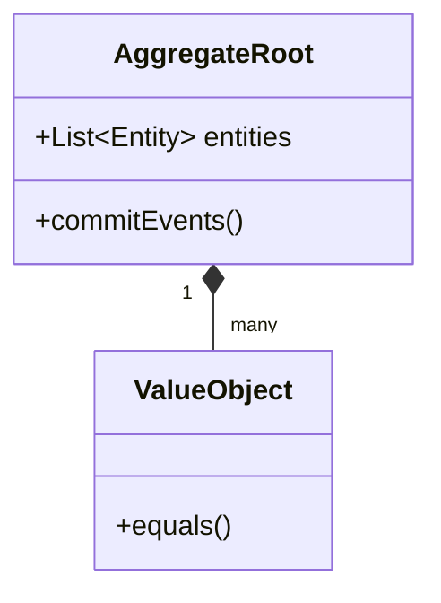

---
description: Vibe coding guidelines and architectural constraints for DDD within the Architecture domain.
tags: [ddd, architecture, best-practices, architecture]
topic: DDD
complexity: Architect
last_evolution: 2026-03-29
vibe_coding_ready: true
technology: DDD
domain: Architecture
level: Senior/Architect
version: Latest
ai_role: Senior DDD Expert
last_updated: 2026-03-29---# Domain-Driven Design - Implementation Guide
## Code patterns and Anti-patterns

### Entity Relationships

### Rules
- Ubiquitous language must be strictly used in code.
