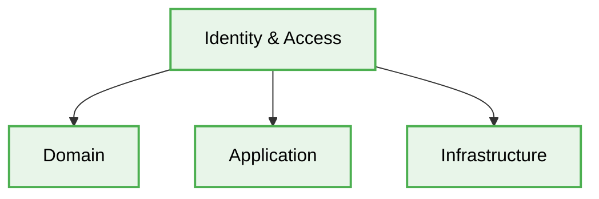

<div align="center">
  # 🏛️ Domain-Driven Design Production-Ready Best Practices
</div>
---

Этот инженерный директив определяет **лучшие практики (best practices)** для архитектуры Domain-Driven Design. Данный документ спроектирован для обеспечения максимальной масштабируемости, безопасности и качества кода при разработке приложений корпоративного уровня.
# Context & Scope
- **Primary Goal:** Предоставить строгие архитектурные правила и практические паттерны для создания масштабируемых систем.
- **Description:** A philosophy and design approach centered entirely around the business "Domain". The whole team communicates using a "Ubiquitous Language," and domains are split into Bounded Contexts.
## Map of Patterns
- 📊 [**Data Flow:** Request and Event Lifecycle](./data-flow.md)
- 📁 [**Folder Structure:** Layering logic](./folder-structure.md)
- ⚖️ [**Trade-offs:** Pros, Cons, and System Constraints](./trade-offs.md)
- 🛠️ [**Implementation Guide:** Code patterns and Anti-patterns](./implementation-guide.md)
## Core Principles

1. **Isolation & Testability:** Changing a single feature doesn't break the entire business process.
2. **Strict Boundaries:** Enforce rigid structural barriers between business logic and infrastructure.
3. **Decoupling:** Decouple how data is stored from how it is queried and displayed.

## Architecture Diagram



---

## 1. Anemic Domain Models

### ❌ Bad Practice
```typescript
// Anemic Domain Entity - Just a data bag
class Order {
  public status: string;
  public totalAmount: number;
}

// Business logic lives entirely in a bloated service
class OrderService {
  public payOrder(order: Order, amount: number): void {
    if (order.status !== 'PENDING') {
      throw new Error('Order cannot be paid');
    }
    if (amount < order.totalAmount) {
      throw new Error('Insufficient amount');
    }
    order.status = 'PAID';
  }
}
```

### ⚠️ Problem
Using Anemic Domain Models breaks the core principle of Domain-Driven Design. The Entity (`Order`) is reduced to a pure data structure without behavior. The business rules ("How does an order get paid?") leak into the `OrderService`, causing logic duplication, difficult testing, and poor encapsulation. The Domain becomes passive.

### ✅ Best Practice
```typescript
// Rich Domain Entity - Encapsulates both data and behavior
class Order {
  private status: 'PENDING' | 'PAID' | 'CANCELLED';
  private totalAmount: number;

  constructor(amount: number) {
    this.totalAmount = amount;
    this.status = 'PENDING';
  }

  // Behavior resides inside the Entity
  public pay(amount: number): void {
    if (this.status !== 'PENDING') {
      throw new Error('MANDATORY: Order must be in PENDING state to be paid');
    }
    if (amount < this.totalAmount) {
      throw new Error('MANDATORY: Payment amount must cover the total order amount');
    }
    this.status = 'PAID';
  }
}

// Service merely acts as an orchestrator
class OrderApplicationService {
  constructor(private readonly orderRepository: IOrderRepository) {}

  public async processPayment(orderId: string, amount: number): Promise<void> {
    const order = await this.orderRepository.findById(orderId);
    order.pay(amount); // Delegating domain logic to the Entity
    await this.orderRepository.save(order);
  }
}
```

### 🚀 Solution
> [!IMPORTANT]
> MANDATORY: Always implement Rich Domain Models. Entities and Aggregates MUST encapsulate both state and the business rules that mutate that state. Services MUST be relegated to application orchestration (fetching data, calling entity methods, and saving data), ensuring that invariant business logic is securely locked inside the Domain layer.
