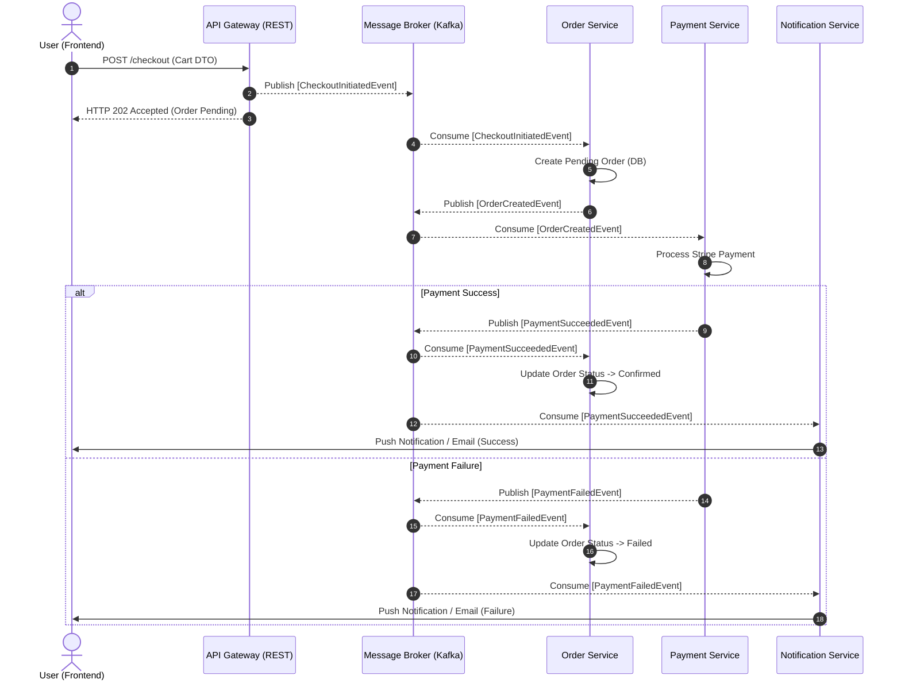

  # 📊 EDA Data Flow (Sequence Blueprint)

---

This document illustrates the execution lifecycle of a distributed, asynchronous event-driven system. It defines the path an initial synchronous request takes as it propagates across independent microservices via a message broker.

## Mental Model & Asynchronous Lifecycle

The architectural contract is simple:
- The **Ingress Gateway (API)** accepts the synchronous HTTP request from the User.
- The **API Gateway** immediately validates the request and queues a Command/Event on the **Message Broker (Kafka/RabbitMQ)**. It returns HTTP 202 Accepted.
- Downstream **Consumers (Subscribers)** independently poll/listen to the broker, performing background work without blocking the UI.
- Finally, the UI relies on WebSocket, Server-Sent Events (SSE), or polling for real-time completion status.

> [!IMPORTANT]
> **Data Flow Constraint:** A microservice handling an event MUST NOT synchronously invoke another microservice. It must process the event, update its localized database, and optionally emit a subsequent domain event.

### Sequence Diagram: Distributed E-Commerce Checkout

---

## The Outbox Pattern (Reliable Publishing)

To ensure dual-write safety (saving state in the local DB and publishing the event to Kafka simultaneously), EDA relies on the **Transactional Outbox Pattern**.

1. The service begins a local DB transaction.
2. The service saves business entity data (e.g., `orders` table).
3. The service inserts an event record in an `outbox` table in the SAME transaction.
4. The service commits the transaction.
5. A background process (e.g., Debezium, CDC) reads the `outbox` table and publishes the messages to Kafka, ensuring "at-least-once" delivery.

---

  [Back to Main Blueprint](./readme.md)   
  <b>Master the event lifecycle to prevent distributed monoliths! 🌊</b>

