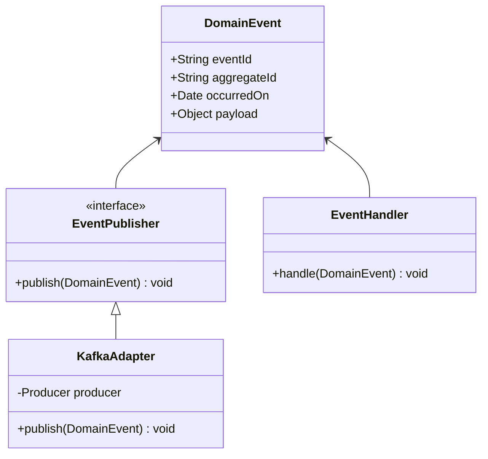

<div align="center">
  # 🛠️ EDA Implementation Guide (Code Blueprint)
</div>

---

This blueprint details strict coding patterns and anti-patterns for implementing Event-Driven Architecture, ensuring "at-least-once" delivery, schema registry compliance, and robust idempotency.

> [!IMPORTANT]
> **Implementation Contract:** All code must adhere to 2026 modern backend standards (Node.js 24+, TypeScript 5.5+, strict types, decorators, or class-based dependency injection). Services must integrate safely with message brokers (Kafka) without tightly coupling business logic.

## Entity & Handler Relationships



---

## 1. Idempotent Consumers (Crucial)

Because Kafka or RabbitMQ may deliver the same message twice (e.g., during a consumer rebalance), handlers must be purely idempotent. Processing the exact same `eventId` twice MUST NOT duplicate the business outcome (e.g., charging a credit card twice).

### ❌ Bad Practice
```typescript
class PaymentEventHandler {
  async handle(event: OrderCreatedEvent) {
    // ❌ Blindly processing the payment every time the event is received!
    // A duplicate Kafka message will charge the user again.
    await this.stripeService.charge(event.payload.amount);
    await this.db.payments.insert({ orderId: event.aggregateId, status: 'PAID' });
  }
}
```

### ✅ Best Practice
```typescript
class PaymentEventHandler {
  async handle(event: OrderCreatedEvent) {
    // ✅ 1. Check if we've already processed this specific event ID
    const alreadyProcessed = await this.db.processedEvents.exists(event.eventId);
    if (alreadyProcessed) {
      this.logger.warn(`Event ${event.eventId} already processed. Skipping.`);
      return;
    }

    // ✅ 2. Execute business logic idempotently
    await this.db.transaction(async (tx) => {
      await this.stripeService.charge(event.payload.amount);
      await tx.payments.insert({ orderId: event.aggregateId, status: 'PAID' });

      // ✅ 3. Record the event ID to prevent duplicate processing
      await tx.processedEvents.insert({ id: event.eventId, processedAt: new Date() });
    });
  }
}
```

---

## 2. The Transactional Outbox Pattern

To solve the "Dual-Write Problem" (saving state to the DB and publishing to Kafka reliably), we use an Outbox table. If the application crashes after saving to the DB but before publishing to Kafka, the message is permanently lost.

### ❌ Bad Practice
```typescript
class OrderService {
  async createOrder(data: CreateOrderDto) {
    // ❌ Dual-write problem!
    const order = await this.db.orders.insert(data); // 1. Save to DB

    // If the server crashes HERE, the event is never published,
    // and downstream services never know the order was created.

    await this.kafkaProducer.send('orders.created', order); // 2. Publish to Broker
  }
}
```

### ✅ Best Practice
```typescript
class OrderService {
  async createOrder(data: CreateOrderDto) {
    // ✅ The Outbox Pattern: Save BOTH the business entity and the event
    // in the exact same ACID database transaction.
    await this.db.transaction(async (tx) => {
      const order = await tx.orders.insert(data);

      const outboxEvent = {
        aggregateType: 'Order',
        aggregateId: order.id,
        eventType: 'OrderCreated',
        payload: JSON.stringify(order),
        createdAt: new Date(),
      };

      await tx.outbox.insert(outboxEvent); // Saves strictly to a local DB table
    });

    // A separate background process (e.g., Debezium or a Polling Worker)
    // reads the 'outbox' table and safely publishes to Kafka.
  }
}
```

---

## 3. Strictly Typed Schemas (Schema Registry)

Microservices evolve independently. If a publisher changes the shape of a JSON event payload, all downstream subscribers will break. Always enforce a Schema Registry (Avro, Protobuf, JSON Schema) for all events.

### ✅ Best Practice (Avro Example)
```typescript
// 1. Define a strict Avro schema for the event
const orderCreatedSchema = {
  type: 'record',
  name: 'OrderCreated',
  fields: [
    { name: 'orderId', type: 'string' },
    { name: 'amount', type: 'double' },
    { name: 'customerId', type: 'string' }
    // Enforces backward compatibility rules via Confluent Schema Registry
  ]
};

class OrderKafkaPublisher {
  async publish(event: DomainEvent) {
    // 2. The payload is validated and serialized against the Schema Registry
    // before it ever reaches the Kafka topic.
    const encodedPayload = await this.schemaRegistry.encode(
      'orders.created-value',
      event.payload
    );

    await this.producer.send({
      topic: 'orders.created',
      messages: [{ key: event.aggregateId, value: encodedPayload }]
    });
  }
}
```

---

<div align="center">
  [Back to Main Blueprint](./readme.md) <br><br>
  <b>Master these implementation constraints to guarantee asynchronous consistency! 🛠️</b>
</div>
