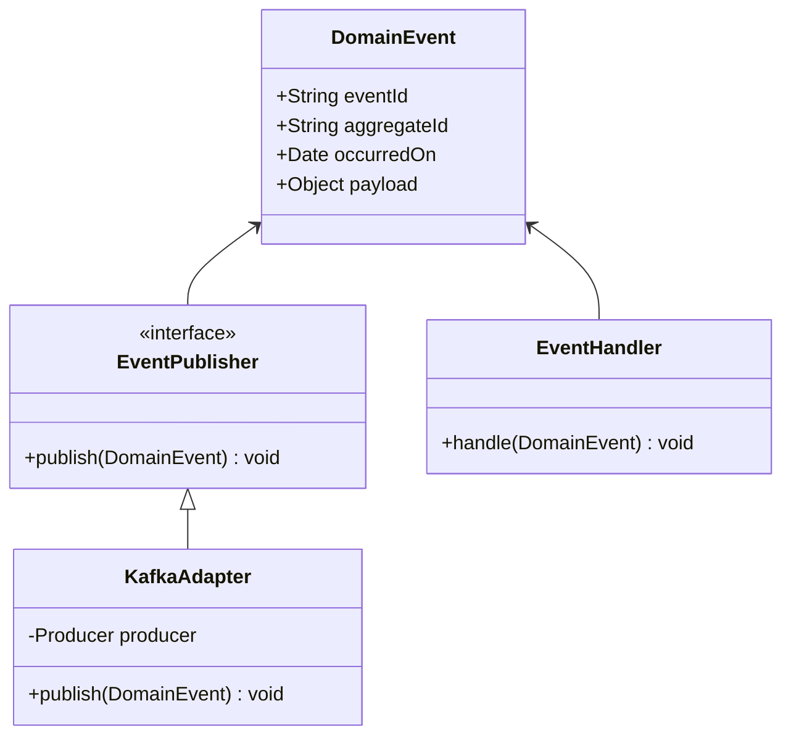

<div align="center">
  # 🛠️ EDA Implementation Guide (Code Blueprint)
</div>
---

This blueprint details strict coding patterns and anti-patterns for implementing Event-Driven Architecture, ensuring "at-least-once" delivery, schema registry compliance, and robust idempotency.

> [!IMPORTANT]
> **Implementation Contract:** All code must adhere to 2026 modern backend standards (Node.js 24+, TypeScript 5.5+, strict types, decorators, or class-based dependency injection). Services must integrate safely with message brokers (Kafka) without tightly coupling business logic.
## Entity & Handler Relationships


```mermaid
classDiagram
    class DomainEvent {
        +String eventId
        +String aggregateId
        +Date occurredOn
        +Object payload
    }
    class EventPublisher {
        <<interface>>
        +publish(DomainEvent) void
    }
    class KafkaAdapter {
        -Producer producer
        +publish(DomainEvent) void
    }
    class EventHandler {
        +handle(DomainEvent) void
    }

    EventPublisher <|-- KafkaAdapter
    DomainEvent <-- EventHandler
    DomainEvent <-- EventPublisher
```
---
## 1. Idempotent Consumers (Crucial)

> [!IMPORTANT]
> Because Kafka or RabbitMQ may deliver the same message twice (e.g., during a consumer rebalance), handlers must be purely idempotent. Processing the exact same `eventId` twice MUST NOT duplicate the business outcome (e.g., charging a credit card twice).

### ❌ Bad Practice
```typescript
class PaymentEventHandler {
  async handle(event: OrderCreatedEvent) {
    // ❌ Blindly processing the payment every time the event is received!
    // A duplicate Kafka message will charge the user again.
    await this.stripeService.charge(event.payload.amount);
    await this.db.payments.insert({ orderId: event.aggregateId, status: 'PAID' });
  }
}
```

### ✅ Best Practice
```typescript
class PaymentEventHandler {
  async handle(event: OrderCreatedEvent) {
    // ✅ 1. Check if we've already processed this specific event ID
    const alreadyProcessed = await this.db.processedEvents.exists(event.eventId);
    if (alreadyProcessed) {
      this.logger.warn(`Event ${event.eventId} already processed. Skipping.`);
      return;
    }

    // ✅ 2. Execute business logic idempotently
    await this.db.transaction(async (tx) => {
      await this.stripeService.charge(event.payload.amount);
      await tx.payments.insert({ orderId: event.aggregateId, status: 'PAID' });

      // ✅ 3. Record the event ID to prevent duplicate processing
      await tx.processedEvents.insert({ id: event.eventId, processedAt: new Date() });
    });
  }
}
```


### ⚠️ Problem
Without tracking `eventId` locally, duplicate deliveries from the broker (due to consumer rebalancing, network drops, or retries) result in duplicate side effects. This leads to double-billing customers, duplicate orders, and compromised system integrity.


### 🚀 Solution
Implementing an Idempotent Receiver pattern with a unique constraint on `eventId` ensures that duplicate events are safely ignored. Wrapping the deduplication check and the business logic within an atomic database transaction guarantees state consistency even under high concurrency.
---
## 2. The Transactional Outbox Pattern

To solve the "Dual-Write Problem" (saving state to the DB and publishing to Kafka reliably), we use an Outbox table. If the application crashes after saving to the DB but before publishing to Kafka, the message is permanently lost.

### ❌ Bad Practice
```typescript
class OrderService {
  async createOrder(data: CreateOrderDto) {
    // ❌ Dual-write problem!
    const order = await this.db.orders.insert(data); // 1. Save to DB

    // If the server crashes HERE, the event is never published,
    // and downstream services never know the order was created.

    await this.kafkaProducer.send('orders.created', order); // 2. Publish to Broker
  }
}
```

### ✅ Best Practice
```typescript
class OrderService {
  async createOrder(data: CreateOrderDto) {
    // ✅ The Outbox Pattern: Save BOTH the business entity and the event
    // in the exact same ACID database transaction.
    await this.db.transaction(async (tx) => {
      const order = await tx.orders.insert(data);

      const outboxEvent = {
        aggregateType: 'Order',
        aggregateId: order.id,
        eventType: 'OrderCreated',
        payload: JSON.stringify(order),
        createdAt: new Date(),
      };

      await tx.outbox.insert(outboxEvent); // Saves strictly to a local DB table
    });

    // A separate background process (e.g., Debezium or a Polling Worker)
    // reads the 'outbox' table and safely publishes to Kafka.
  }
}
```


### ⚠️ Problem
The Dual-Write Anti-Pattern occurs when an application attempts to update a database and publish a message to a broker sequentially. Without distributed transactions, a failure between the two operations leaves the system in an inconsistent state (e.g., the DB is updated, but the event is never published).


### 🚀 Solution
The Transactional Outbox pattern guarantees atomic operations. By saving the event to a local `outbox` table within the same DB transaction as the domain change, we achieve atomicity. A separate, reliable process (like a Debezium Connector or background poller) then reads the outbox table and guarantees "at-least-once" delivery to the broker.
---
## 3. Strictly Typed Schemas (Schema Registry)

Microservices evolve independently. If a publisher changes the shape of a JSON event payload, all downstream subscribers will break. Always enforce a Schema Registry (Avro, Protobuf, JSON Schema) for all events.

### ✅ Best Practice (Avro Example)
```typescript
// 1. Define a strict Avro schema for the event
const orderCreatedSchema = {
  type: 'record',
  name: 'OrderCreated',
  fields: [
    { name: 'orderId', type: 'string' },
    { name: 'amount', type: 'double' },
    { name: 'customerId', type: 'string' }
    // Enforces backward compatibility rules via Confluent Schema Registry
  ]
};

class OrderKafkaPublisher {
  async publish(event: DomainEvent) {
    // 2. The payload is validated and serialized against the Schema Registry
    // before it ever reaches the Kafka topic.
    const encodedPayload = await this.schemaRegistry.encode(
      'orders.created-value',
      event.payload
    );

    await this.producer.send({
      topic: 'orders.created',
      messages: [{ key: event.aggregateId, value: encodedPayload }]
    });
  }
}
```


### ❌ Bad Practice
```typescript
class OrderKafkaPublisher {
  async publish(event: DomainEvent) {
    // ❌ Publishing raw, untyped JSON objects
    // Downstream consumers might break if 'amount' is suddenly renamed to 'totalAmount'
    await this.producer.send({
      topic: 'orders.created',
      messages: [{ key: event.aggregateId, value: JSON.stringify(event.payload) }]
    });
  }
}
```


### ⚠️ Problem
Publishing unstructured JSON couples microservices dangerously. If the upstream service changes a field name or type, downstream consumers will crash unexpectedly, causing cascading failures and data corruption across the distributed system.


### 🚀 Solution
A Schema Registry enforces a strict, versioned contract (e.g., Avro, Protobuf, JSON Schema) between producers and consumers. It serializes data efficiently, rejects non-compliant payloads at the producer level, and ensures backward/forward compatibility rules are respected across all teams.
---

<div align="center">
  [Back to Main Blueprint](./readme.md) <br><br>
  <b>Master these implementation constraints to guarantee asynchronous consistency! 🛠️</b>
</div>


> [!NOTE]
> **Internal Routing:** For more context, refer back to the [Architecture Map](../readme.md).
