  # 📊 Event Sourcing Data Flow

---

## The Request and Event Lifecycle

In Event Sourcing, the flow of data is distinct from traditional CRUD applications.

1. **Command Execution:** The client sends a Command (e.g., `CreateOrderCommand`) to the Application Service.
2. **State Reconstruction:** The Application Service loads the Aggregate from the Event Store by fetching all past events for that Aggregate ID and replaying them sequentially to reconstruct the current state.
3. **Business Logic Evaluation:** The Aggregate evaluates the Command against its current state to ensure business invariants are met.
4. **Event Emission:** If the Command is valid, the Aggregate produces one or more Events (e.g., `OrderCreatedEvent`) representing the outcome.
5. **Event Persistence:** The new Events are appended to the Event Store. This is the single source of truth.
6. **Projection:** A message broker or Event Bus listens to the Event Store and publishes the new events. Projectors consume these events to update separated Read Models (CQRS), ensuring queries are highly optimized.

```mermaid
graph LR
    A[Command Execution] --> B[State Reconstruction]
    B --> C[Business Logic Evaluation]
    C --> D[Event Emission]
    D --> E[Event Persistence]
    E --> F[Projection]

    classDef component fill:#e8f5e9,stroke:#4caf50,stroke-width:2px,color:#000;
    classDef default fill:#e1f5fe,stroke:#03a9f4,stroke-width:2px,color:#000;

    class A component;
    class B component;
    class C component;
    class D component;
    class E component;
    class F component;
```

