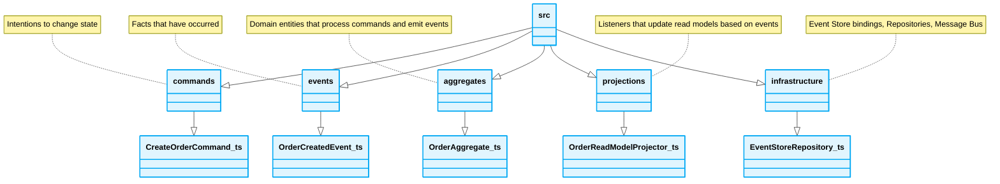

<div align="center">
  # 📁 Event Sourcing Folder Structure
</div>

---

## Directory Blueprint

```text
src/
├── 📁 commands/            # Intentions to change state
│   └── CreateOrderCommand.ts
├── 📁 events/              # Facts that have occurred
│   └── OrderCreatedEvent.ts
├── 📁 aggregates/          # Domain entities that process commands and emit events
│   └── OrderAggregate.ts
├── 📁 projections/         # Listeners that update read models based on events
│   └── OrderReadModelProjector.ts
└── 📁 infrastructure/      # Event Store bindings, Repositories, Message Bus
    └── EventStoreRepository.ts
```


