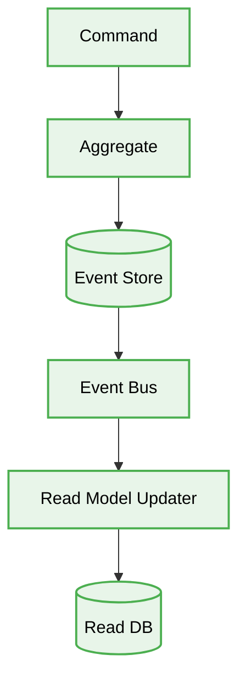

<div align="center">
  # 🏛️ Event Sourcing Production-Ready Best Practices
</div>
---

This engineering directive defines the **best practices** for the Event Sourcing architecture. This document is designed to ensure maximum scalability, security, and code quality when developing applications that require a robust audit trail and complex state reconstruction.

# Context & Scope
- **Primary Goal:** Provide strict architectural rules and practical patterns for building systems where state is derived from an immutable sequence of events.
- **Description:** A pattern where all changes to application state are stored as a sequence of events. Instead of storing just the current state of the data in a domain, use an append-only store to record the full series of actions taken on that data.

## Map of Patterns
- 📊 [**Data Flow:** Request and Event Lifecycle](./data-flow.md)
- 📁 [**Folder Structure:** Layering logic](./folder-structure.md)
- ⚖️ [**Trade-offs:** Pros, Cons, and System Constraints](./trade-offs.md)
- 🛠️ [**Implementation Guide:** Code patterns and Anti-patterns](./implementation-guide.md)

## Architecture Diagram



---

## Core Principles

1. **Immutable Log:** Events are facts that happened in the past. They cannot be changed or deleted, only appended.
2. **Replayable State:** Any entity's current state can be fully reconstructed by replaying all its past events from the beginning.
3. **Decoupled Read/Write:** Often combined with CQRS, Event Sourcing naturally decouples the write model (Event Store) from the read models (Projections).

## 1. Mutating State Instead of Appending Events

### ❌ Bad Practice
```typescript
class BankAccount {
  constructor(private balance: number = 0) {}

  public deposit(amount: number) {
    // Bad: Overwriting the current state directly
    // The history of *how* we arrived at this balance is lost
    this.balance += amount;
    database.save(this);
  }
}
```

### ⚠️ Problem
Directly mutating state overwrites historical data. If there is a bug or an audit requirement, it is impossible to determine *why* an account has a specific balance. We have only the final snapshot, not the journey.

### ✅ Best Practice
> [!NOTE]
> **Internal Routing:** For more context, refer back to the [Map of Patterns](../readme.md).

```typescript
class BankAccount {
  private balance: number = 0;
  private changes: DomainEvent[] = [];

  public deposit(amount: number) {
    // 1. Create the event representing the fact
    const event = new MoneyDepositedEvent({ amount, timestamp: new Date() });

    // 2. Apply the event to update local state
    this.apply(event);

    // 3. Append to uncommitted changes for the Event Store
    this.changes.push(event);
  }

  private apply(event: DomainEvent) {
    if (event instanceof MoneyDepositedEvent) {
      this.balance += event.payload.amount;
    }
  }
}
```

### 🚀 Solution
Never overwrite state directly. Actions must result in creating immutable Domain Events. State mutations occur strictly by *applying* these events. This guarantees a mathematically precise audit log and allows reconstructing the exact state of the system at any point in time by replaying the event stream.
