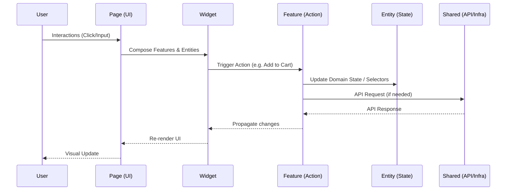

# Feature-Sliced Design (FSD) - Data Flow

## Request and Event Lifecycle

### Constraints
- Unidirectional flow: State changes must propagate from top to bottom.
- Features encapsulate business logic.
- Entities store domain state.
