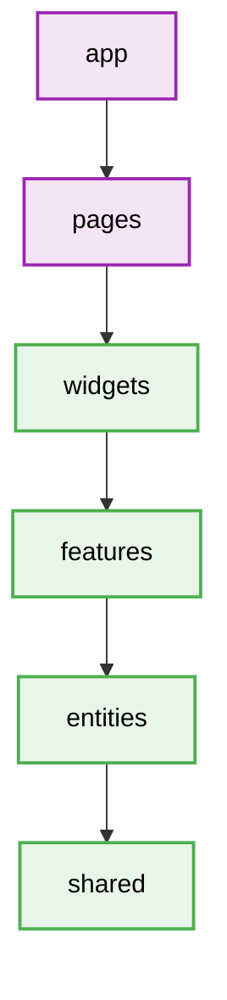

# Feature-Sliced Design (FSD) - Folder Structure

## Layering publisher/subscriber logic

### Constraints
- **app**: Global settings, styles, providers.
- **pages**: Composition of widgets and features. Route components.
- **widgets**: Composition layer. Combines features and entities into meaningful blocks.
- **features**: User scenarios, business value actions (e.g., SendMessage, AddToCart).
- **entities**: Business entities (e.g., User, Product, Order).
- **shared**: Reusable UI components, utilities, api setup.
