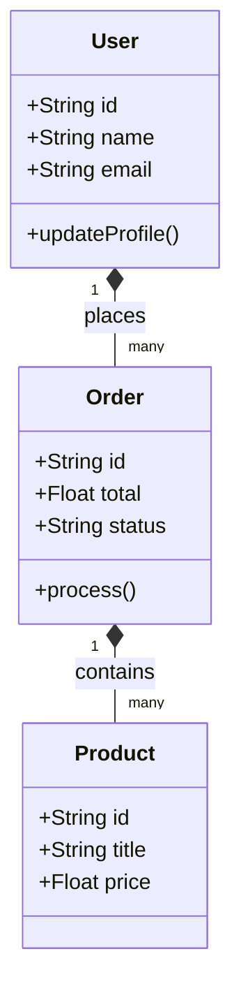

# Feature-Sliced Design (FSD) - Implementation Guide

## Code patterns and Anti-patterns

### Entity Relationships

### Rules for implementation:
1. **Public API**: Every slice and segment must have an `index.ts` (Public API) to expose its contents.
2. **Cross-Slice Imports**: Cross-slice imports within the same layer are strictly prohibited.
3. **Global State**: Global state (like Redux or Zustand) should be split across entities and features, not centralized in one huge store.

### Anti-patterns:
- **God Object**: Creating a single feature that handles too many responsibilities.
- **Bypassing Layers**: Importing `shared` directly into `app` without going through intermediate layers if applicable, though `shared` is accessible everywhere. More importantly, `entities` importing from `features` is a strict violation.
