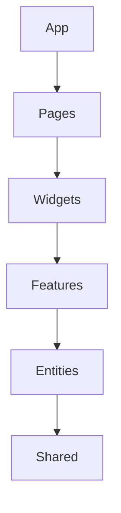

<div align="center">
  
  
  # 🍰 Feature-Sliced Design (FSD)
</div>

---

## Context & Scope
- **Primary Goal:** Enforce a strict architectural methodology for Frontend web applications driven by business logic and modular isolation.
- **Target Tooling:** Cursor, Windsurf, Antigravity.
- **Tech Stack Version:** Agnostic (React, Vue, Angular)

---

## 1. Unidirectional Dependency Rule
**Constraint:** Modules may only import from layers situated STRICTLY lower within the architectural hierarchy.
**Instruction:** Construct the application with specific hierarchical bounds: `app` (highest), `pages`, `widgets`, `features`, `entities`, `shared` (lowest).
**Code Example:**
```typescript
// ❌ Bad: Entity imports from a Feature (Upward violation)
import { addToCart } from 'features/cart'; // Inside entities/product

// ✅ Good: Feature orchestrates Entities (Downward compliant)
import { ProductCard } from 'entities/product'; // Inside features/cart
```



**Checklist:**
- [ ] Linters are employed to prevent cyclic or upward dependencies.
- [ ] Components do not leak their details; cross-layer interactions happen via public API boundaries (`index.ts`).
- [ ] The `shared` layer contains truly stateless and framework-specific utility code.
