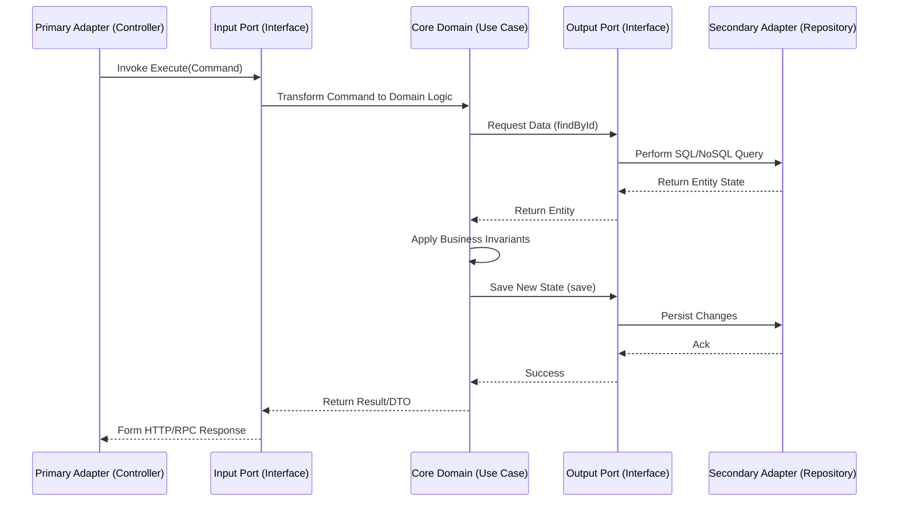

# 🔄 Hexagonal Architecture Data Flow Best Practices

  **Execution paths and communication between layers.**

---

## 🔁 The Sequence of Execution

In Hexagonal Architecture, a request from the outside world must pierce through the layers strictly via defined Interfaces (Ports).

## ⛔ Boundary Constraints (Data Flow Rules)

1. **No External Imports in Domain:** The Core Domain must NEVER import code from an Adapter (e.g., `import { PostgresDB } from '../adapters/db'`). It only implements Interfaces.
2. **Adapter Injection:** Adapters are injected into the Domain (typically during app startup) via the Output Ports (Interfaces).
3. **Primary vs Secondary:**
   - Primary Adapters (Driving) call the Domain (Input Ports). Examples: REST Controllers, CLI scripts, Event Listeners.
   - Secondary Adapters (Driven) are called by the Domain (Output Ports). Examples: Database Repositories, SMTP Clients, External API clients.
4. **Data Translation:** Data must be mapped at the boundary. Do not pass the internal DB Model directly out to the Primary Adapter. Use DTOs at the Ports.
