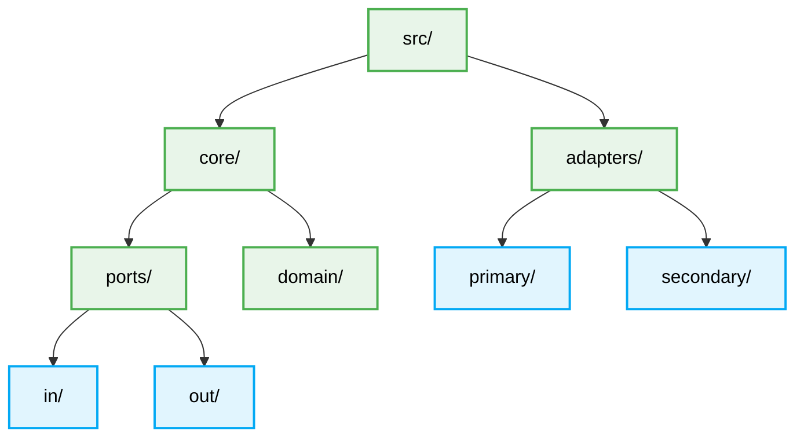

# 📁 Folder Structure Best Practices for Hexagonal Architecture

<div align="center">
  **Strict directory blueprints for zero-approval AI parsing.**
</div>

---

## 🌳 The Root Hierarchy

A properly defined Hexagonal architecture clearly separates its concerns at the file-system level. AI Agents are expected to enforce this strict separation.



## 🏗️ Example Directory Content

```text
src/
├── 📁 core/                 # The Heart of the System (No External Tech)
│   ├── 📁 domain/           # Entities, Value Objects, Business Rules
│   │   ├── User.ts
│   │   └── AccountId.ts
│   └── 📁 ports/            # Interfaces defining interactions
│       ├── 📁 in/           # Primary Ports (Use Cases / Commands)
│       │   └── CreateUserUseCase.ts
│       └── 📁 out/          # Secondary Ports (SPIs / Repositories)
│           ├── UserRepositoryPort.ts
│           └── EmailSenderPort.ts
└── 📁 adapters/             # Concrete implementations
    ├── 📁 primary/          # Entry Points (Driving Adapters)
    │   ├── 📁 http/         # REST Controllers / Express Routes
    │   │   └── UserController.ts
    │   └── 📁 cli/          # Console Commands
    └── 📁 secondary/        # Exit Points (Driven Adapters)
        ├── 📁 database/     # ORMs (TypeORM, Prisma)
        │   └── PostgresUserRepository.ts
        └── 📁 external/     # 3rd Party APIs (SendGrid, Stripe)
            └── SendGridEmailSender.ts
```

## ⛔ Boundary Constraints

1. **Isolation in `core/`:** Code inside `core/` is forbidden from importing modules from `adapters/`.
2. **Implementation in `adapters/`:** Code inside `adapters/` relies heavily on implementing the interfaces declared in `core/ports/`.
3. **Primary vs Secondary File Naming:** Append descriptive suffixes to Adapters to clarify intent (e.g., `PostgresUserRepository`, `StripePaymentService`).
