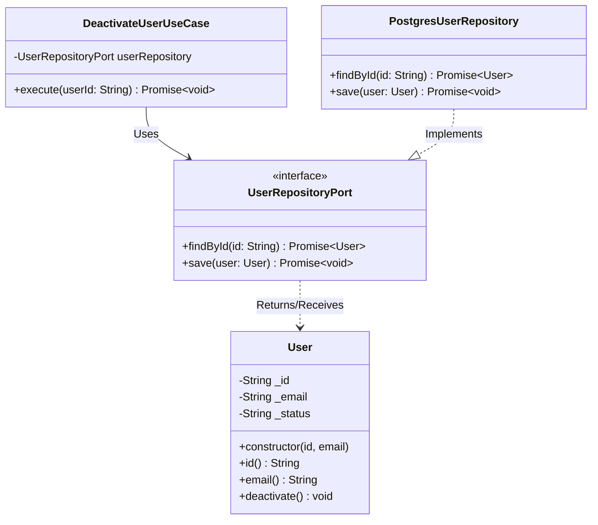

# 🛠️ Hexagonal Architecture Implementation Guide

<div align="center">
  **Executable blueprints and constraints for AI-agent code generation.**
</div>

---

## ⚡ The Vibe Coding Instructions (Constraints)

For any code generated within the Hexagonal Architecture ecosystem, the following boundaries must be strictly enforced:

1.  **Core Isolation (No External Imports):**
    Code inside `src/core/domain/` or `src/core/ports/` must have **ZERO** imports from `src/adapters/` or any external UI/DB frameworks.

2.  **Strict Interface Fulfillment:**
    Code in `src/adapters/secondary/` must implement interfaces declared in `src/core/ports/out/`. It acts as a bridge to external technologies (e.g., PostgreSQL, SendGrid).

3.  **Boundary DTO Translation:**
    Adapters must map raw external data (HTTP Requests, Database Rows) into pure Domain Entities before passing them inward. When returning data, Domain Entities must be translated back into Adapter-specific DTOs before reaching the outside world. Do not leak the Core Entity to an HTTP response directly.

---

## 💻 Concrete Code Examples

### 🧩 Entity Relationships (Class Diagram)



### ✅ Best Practice: Core Domain (`src/core/domain/User.ts`)

```typescript
// Pure domain object - No framework annotations like @Entity or @Table
export class User {
    private readonly _id: string;
    private _email: string;
    private _status: 'ACTIVE' | 'INACTIVE';

    constructor(id: string, email: string) {
        this._id = id;
        this._email = email;
        this._status = 'ACTIVE';
    }

    public get id(): string { return this._id; }
    public get email(): string { return this._email; }

    public deactivate(): void {
        this._status = 'INACTIVE';
    }
}
```

### ✅ Best Practice: Output Port (`src/core/ports/out/UserRepositoryPort.ts`)

```typescript
// Interface defined by the Domain to specify its needs from a DB
import { User } from '../../domain/User';

export interface UserRepositoryPort {
    findById(id: string): Promise<User | null>;
    save(user: User): Promise<void>;
}
```

### ✅ Best Practice: Secondary Adapter (`src/adapters/secondary/database/PostgresUserRepository.ts`)

```typescript
// Adapter implementing the Port using an ORM (e.g., TypeORM or Prisma)
import { UserRepositoryPort } from '../../../core/ports/out/UserRepositoryPort';
import { User } from '../../../core/domain/User';
import { db } from '../../../infrastructure/db'; // Imaginary DB client
import { UserMapper } from './UserMapper'; // Maps DB Row to Domain Entity

export class PostgresUserRepository implements UserRepositoryPort {
    async findById(id: string): Promise<User | null> {
        const rawRow = await db.query('SELECT * FROM users WHERE id = $1', [id]);
        if (!rawRow) return null;
        return UserMapper.toDomain(rawRow);
    }

    async save(user: User): Promise<void> {
        await db.query('INSERT INTO users(id, email, status) VALUES($1, $2, $3)', [
            user.id, user.email, user.status
        ]);
    }
}
```

### ✅ Best Practice: Use Case / Input Port (`src/core/ports/in/DeactivateUserUseCase.ts`)

```typescript
import { UserRepositoryPort } from '../out/UserRepositoryPort';

export class DeactivateUserUseCase {
    constructor(private readonly userRepository: UserRepositoryPort) {}

    async execute(userId: string): Promise<void> {
        const user = await this.userRepository.findById(userId);
        if (!user) throw new Error('User not found');

        user.deactivate(); // Business Rule application

        await this.userRepository.save(user); // Persist state
    }
}
```

### ✅ Best Practice: Primary Adapter (`src/adapters/primary/http/UserController.ts`)

```typescript
// HTTP Controller invoking the Use Case
import { Request, Response } from 'express';
import { DeactivateUserUseCase } from '../../../core/ports/in/DeactivateUserUseCase';

export class UserController {
    constructor(private readonly deactivateUserUseCase: DeactivateUserUseCase) {}

    async deactivate(req: Request, res: Response) {
        try {
            await this.deactivateUserUseCase.execute(req.params.id);
            res.status(200).send({ message: 'User deactivated successfully' });
        } catch (error) {
            res.status(400).send({ error: error.message });
        }
    }
}
```
