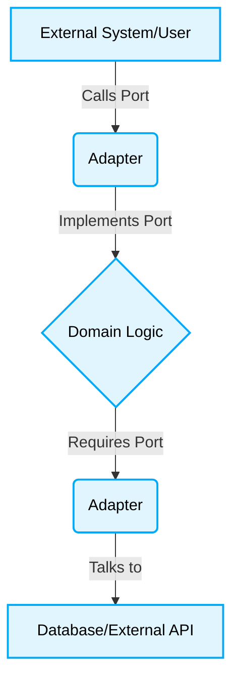

# 🛑 Hexagonal Architecture Production-Ready Best Practices
# 🎯 Context & Scope
- **Primary Goal:** Document and execute the best practices for the Hexagonal Architecture pattern.
- **Target Tooling:** AI Agents and Human Developers.
- **Tech Stack Version:** Agnostic

<div align="center">
  

  **Ports and Adapters for scalable, testable code.**
</div>
---
## 🗺️ Map of Patterns (Hexagonal Modules)

This pattern documentation has been decomposed into specialized modules for zero-approval AI parsing and human comprehension.

- 🌊 **[Data Flow](./data-flow.md):** Understand the execution paths and sequences.
- 📁 **[Folder Structure](./folder-structure.md):** The strict directory blueprints.
- ⚖️ **[Trade-offs](./trade-offs.md):** Pros, cons, and architectural constraints.
- 🛠️ **[Implementation Guide](./implementation-guide.md):** Step-by-step rules and code constraints for Vibe Coding.



## 🚀 The Core Philosophy

Hexagonal Architecture (Ports & Adapters) ensures the core business logic is isolated from specific external technologies.
All interactions with the DB, UI, or other systems happen through **Ports** (interfaces), and are fulfilled by **Adapters** (concrete implementations).

> **AI Constraint:** Always generate the Core Domain first. The Domain must have ZERO dependencies on frameworks or libraries (except language core features).

## 🚧 1. Domain Logic Depending on External Adapters

### ❌ Bad Practice
```typescript
// Core Domain Service
import { S3Uploader } from '../../adapters/aws-s3.adapter';

export class ProcessDocumentService {
  constructor(private readonly s3Uploader: S3Uploader) {}

  async process(file: Buffer) {
    // Domain logic is strictly coupled to AWS S3 implementation
    const url = await this.s3Uploader.upload(file);
    return { status: 'processed', url };
  }
}
```

### ⚠️ Problem
The Core Domain is directly importing and depending on a specific technical implementation (`AWS S3`). If the project migrates to Azure or GCP, the core business logic must be rewritten. Testing requires a live S3 connection or complex module mocking.

### ✅ Best Practice
```typescript
// Port (Interface defined in the Core Domain)
export interface IFileStoragePort {
  upload(file: Buffer): Promise<string>;
}

// Core Domain Service
export class ProcessDocumentService {
  // Depends on the abstraction (Port), NOT the implementation
  constructor(private readonly storagePort: IFileStoragePort) {}

  async process(file: Buffer) {
    const url = await this.storagePort.upload(file);
    return { status: 'processed', url };
  }
}
```

### 🚀 Solution
Apply the Dependency Inversion Principle using Ports. The Core Domain defines *what* it needs via interfaces (Ports). The Infrastructure layer implements *how* it's done via concrete Adapters. The Domain remains pristine, technology-agnostic, and trivially unit-testable using memory-based mocks.
