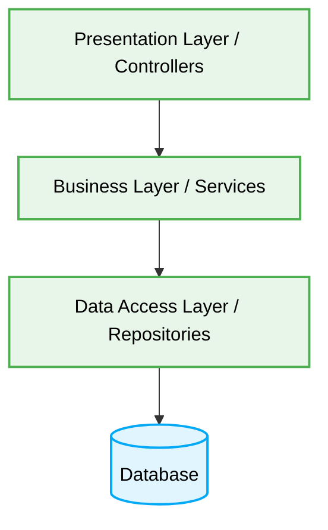

# 🥞 Layered Architecture (N-Tier) Production-Ready Best Practices

[🏠 На главную](../readme.md)

# 🎯 Context & Scope
- **Primary Goal:** Document and strictly enforce best practices for Layered Architecture (N-Tier) to ensure separation of concerns and maintainability.
- **Target Tooling:** AI Agents and Human Developers.
- **Tech Stack Version:** Agnostic

<div align="center">
  

  **Deterministic blueprints for traditional N-Tier applications.**
</div>

---
## 🗺️ Map of Patterns (Layered Modules)

This architecture organizes the system into horizontal layers, where each layer has a specific role (Presentation, Business Logic, Data Access). It relies on strict top-to-bottom dependency flow.

- 🌊 **Data Flow:** Presentation -> Logic -> Data -> Database.
- 📁 **Folder Structure:** Separation by technical concern rather than business domain.
- ⚖️ **Trade-offs:** Simplicity vs. High Coupling.
- 🛠️ **Implementation Guide:** Rules for defining strict layer boundaries.

## 📐 Architecture Diagram



## 🧱 Core Principles

1. **Separation of Concerns:** Each layer handles a specific aspect of the application.
2. **Top-to-Bottom Flow:** Higher layers can depend on lower layers, but lower layers MUST NOT depend on higher layers.
3. **Closed Layers:** Requests must pass through each layer sequentially without skipping layers (to enforce validation and business rules).

---

## 🚧 1. Layer Bypass (The Wormhole Anti-pattern)

### ❌ Bad Practice
```typescript
class UserController {
  constructor(private readonly db: Database) {}

  async getUser(req: Request, res: Response) {
    // Skipping the Business Layer and accessing Data Layer directly
    const user = await this.db.query(`SELECT * FROM users WHERE id = ${req.params.id}`);
    return res.json(user);
  }
}
```

### ⚠️ Problem
Bypassing the Business Logic layer directly from the Presentation layer creates a "wormhole." This leads to fragmented business rules, duplicated code, and difficulty in testing, as authorization or domain validations that should exist in the Business layer are skipped entirely.

### ✅ Best Practice

> [!NOTE]
> **Internal Routing:** For more context, refer back to the [Architecture Map](../readme.md).

```typescript
// 1. Presentation Layer (Controller) handles HTTP
class UserController {
  constructor(private readonly userService: UserService) {}

  async getUser(req: Request, res: Response) {
    // Delegates to the Business Layer
    const user = await this.userService.getUserById(req.params.id);
    return res.json(user);
  }
}

// 2. Business Layer (Service) handles logic
class UserService {
  constructor(private readonly userRepository: UserRepository) {}

  async getUserById(id: string) {
    if (!isValidId(id)) throw new Error("Invalid ID");
    // Delegates to the Data Access Layer
    return this.userRepository.findById(id);
  }
}

// 3. Data Access Layer (Repository) handles DB
class UserRepository {
  constructor(private readonly db: Database) {}

  async findById(id: string) {
    return this.db.query(`SELECT * FROM users WHERE id = ${id}`);
  }
}
```

### 🚀 Solution
Strictly enforce "Closed Layers". Every request from the Presentation layer MUST go through the Business Logic layer before reaching the Data Access layer. This guarantees that all business constraints and validations are deterministically applied, creating a predictable execution flow for AI Agents.
