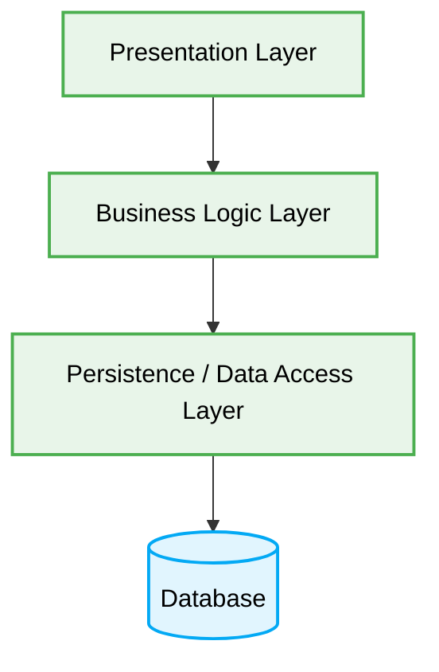

<div align="center">
  # 🏛️ Layered Architecture (N-Tier) Production-Ready Best Practices
</div>

---

This engineering directive defines the **best practices** for Layered Architecture (also known as N-Tier Architecture). This document is designed to ensure maximum scalability, maintainability, and code quality by establishing strict hierarchical layer boundaries.

# Context & Scope
- **Primary Goal:** Document and strictly enforce best practices for Layered Architecture to guarantee proper separation of concerns and deterministic system behavior.
- **Target Tooling:** AI Agents and Human Developers.
- **Tech Stack Version:** Agnostic

<div align="center">
  

  **Deterministic hierarchical blueprints for structured applications.**
</div>

---
## 🗺️ Map of Patterns (Layered Modules)

This architecture defines strict hierarchical boundaries separating different aspects of the system. Data strictly flows downward from one layer to the next adjacent layer.

- 🌊 **Data Flow:** Presentation → Business → Persistence → Database.
- 📁 **Folder Structure:** Rigid separation of UI, Services, and Repositories.
- ⚖️ **Trade-offs:** Simplicity vs. Boilerplate code.
- 🛠️ **Implementation Guide:** Rules for defining strict closed layers.



## 🚀 The Core Philosophy

Layered Architecture establishes a hierarchical flow of dependencies where components in a specific layer can only interact with components in the same layer or the layer immediately below it. This is known as a **closed layer** architecture.

> [!IMPORTANT]
> **AI Constraint:** Agents MUST NOT bypass layers. The Presentation layer MUST NOT communicate directly with the Persistence layer. All communication MUST pass sequentially through the intermediary Business layer to ensure deterministic enforcement of business rules.

---

## 1. Bypassing Intermediary Layers (Layer Leaks)

### ❌ Bad Practice
```typescript
class UserController {
  // Presentation layer directly importing from Persistence layer
  constructor(private readonly userRepository: UserRepository) {}

  async getUser(req: Request, res: Response) {
    // Skipping Business Layer logic
    const user = await this.userRepository.findById(req.params.id);
    return res.status(200).json(user);
  }
}
```

### ⚠️ Problem
When higher layers bypass intermediary layers to communicate directly with lower layers, the architecture becomes "open" and leaky. This circumvents critical business rules, authorization checks, and validation logic that reside in the bypassed layer. It leads to duplicate logic, fragile tight coupling, and massive security risks.

### ✅ Best Practice
```typescript
// 1. Presentation Layer
class UserController {
  // Strictly depends on the adjacent Business Layer
  constructor(private readonly userService: UserService) {}

  async getUser(req: Request, res: Response) {
    const user = await this.userService.getUserProfile(req.params.id);
    return res.status(200).json(user);
  }
}

// 2. Business Layer
class UserService {
  // Enforces business rules before calling Persistence
  constructor(private readonly userRepository: UserRepository) {}

  async getUserProfile(id: string) {
    if (!isValidId(id)) throw new Error("Invalid ID");

    const user = await this.userRepository.findById(id);
    if (!user) throw new Error("User not found");

    // Business rule application
    user.lastAccess = new Date();
    await this.userRepository.save(user);

    return user;
  }
}

// 3. Persistence Layer
class UserRepository {
  async findById(id: string) {
    return db.query(`SELECT * FROM users WHERE id = ?`, [id]);
  }
}
```

### 🚀 Solution
Strictly enforce **closed layers**. Every request must travel through each layer sequentially. The `Presentation` layer must solely translate incoming requests and pass them to the `Business` layer. The `Business` layer applies domain rules and delegates data operations to the `Persistence` layer. This guarantees determinism, proper isolation of concerns, and O(1) impact when refactoring an individual layer's internal implementation.
