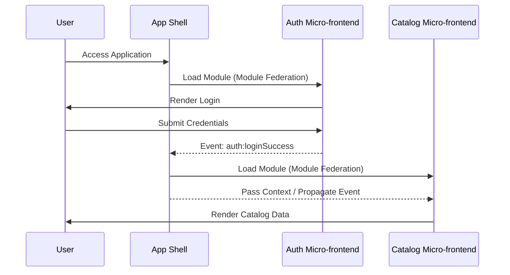

<div align="center">
  # 📊 Micro-frontends Data Flow
</div>

---

This document defines strict rules for the data lifecycle, event handling, and request flows in the Micro-frontends architecture.

## Request and Event Lifecycle

### 🚧 1. Synchronous Global Communication (Anti-Pattern)

#### ❌ Bad Practice
```javascript
// MFE Auth synchronously calling an exposed method on MFE App Shell
window.AppShell.updateUserSession(userData);
```

#### ⚠️ Problem
Synchronous calls introduce severe, rigid coupling. If the App Shell hasn't loaded or changes its method signature, the MFE Auth crashes. It makes parallel development nearly impossible and creates hard dependencies on loading order.

#### ✅ Best Practice
```javascript
// MFE Auth publishes an event asynchronously
const loginEvent = new CustomEvent('auth:loginSuccess', {
  detail: { userId: userData.id, token: userData.token }
});
window.dispatchEvent(loginEvent);

// App Shell subscribes to the event
window.addEventListener('auth:loginSuccess', (e) => {
  sessionManager.initialize(e.detail.token);
});
```

#### 🚀 Solution
Embrace an asynchronous, event-driven architecture using robust event buses or native browser CustomEvents. This guarantees total decoupling and ensures that the system components are completely resilient to missing services or delayed initializations.

---

## Data Flow Diagram


