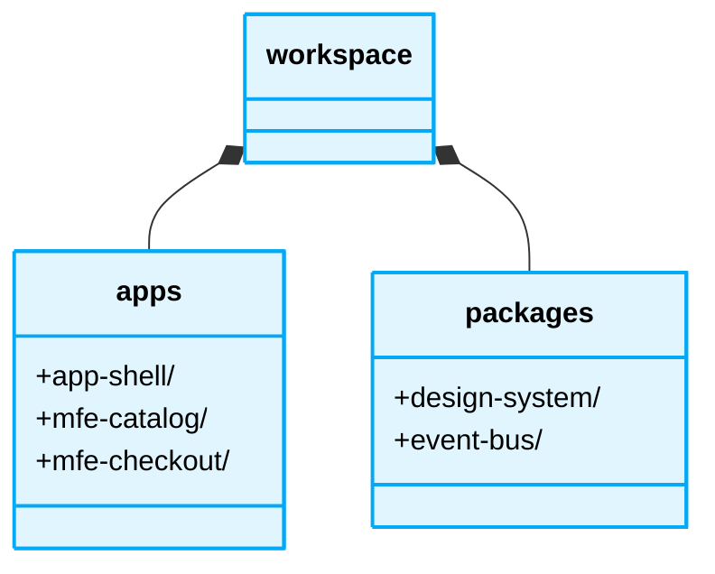

<div align="center">
  # 📁 Micro-frontends Folder Structure
</div>

---

This document defines strict rules for the directory structure and logical layering in the Micro-frontends architecture to ensure maximum isolation.

## Directory Layout Rules

### 1. Monorepo vs Polyrepo Constraints

#### ❌ Bad Practice
```text
monorepo/
├── packages/
│   ├── shared-ui/ (contains business logic!)
│   ├── app-shell/
│   ├── mfe-auth/ (imports directly from app-shell)
```

#### ⚠️ Problem
Storing business logic in shared libraries or directly importing cross-package code defeats the purpose of micro-frontends. It binds deployment cycles together, meaning a change in `shared-ui` forces all dependent MFEs to re-test and redeploy simultaneously.

#### ✅ Best Practice
```text
workspace/
├── apps/
│   ├── app-shell/ (Entry point, Router, Module Federation config)
│   ├── mfe-catalog/ (Independent application)
│   └── mfe-checkout/ (Independent application)
├── packages/
│   ├── design-system/ (Pure, dumb UI components only)
│   └── event-bus/ (Agnostic communication contract types)
```




### Structural Comparison: Monorepo vs Polyrepo for MFEs

| Feature | Monorepo (Workspace) | Polyrepo (Independent Repos) |
| :--- | :--- | :--- |
| **Code Sharing** | Easy (via local packages) | Hard (requires publishing to npm) |
| **Dependency Management** | Centralized (Single source of truth) | Decentralized (Version conflicts likely) |
| **CI/CD Complexity** | High (Requires smart build tools like Nx/Turborepo) | Low (Standard pipelines per repo) |
| **Autonomy** | Medium (Shared tooling constraints) | High (Total independence) |

#### 🚀 Solution
Structure your repository (whether mono or polyrepo) to ensure each application folder (`mfe-*`) operates as a completely standalone entity. Shared libraries must be restricted strictly to agnostic utilities and purely visual design system components. Ensure zero business logic crossover.
