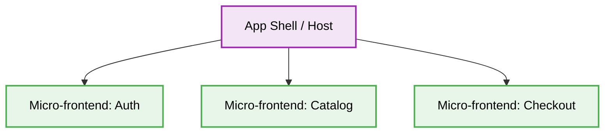

<div align="center">
  # 🧩 Micro-frontends Production-Ready Best Practices
</div>

---

This engineering directive defines the **best practices** for the Micro-frontends architecture. This document is designed to ensure maximum scalability, security, and code quality when developing enterprise-level frontend applications.

# Context & Scope
- **Primary Goal:** Provide strict architectural rules and practical patterns for breaking down a monolithic frontend into independent, deployable micro-applications.
- **Description:** An architectural style where independently deliverable frontend applications are composed into a greater whole. This enables multiple teams to work simultaneously without stepping on each other's toes.

## Map of Patterns
- 📊 [**Data Flow:** Request and Event Lifecycle](./data-flow.md)
- 📁 [**Folder Structure:** Layering logic](./folder-structure.md)
- ⚖️ [**Trade-offs:** Pros, Cons, and System Constraints](./trade-offs.md)
- 🛠️ [**Implementation Guide:** Code patterns and Anti-patterns](./implementation-guide.md)

## Core Principles

1. **Independent Deployments:** Each micro-frontend must be deployable on its own without requiring a redeployment of the entire system.
> [!IMPORTANT]
> 2. **Technology Agnostic (Optional but powerful):** Different teams MUST use different frameworks (React, Vue, Angular) if necessary, though standardization is MANDATORY for performance.
> [!IMPORTANT]
> 3. **Isolated State:** Micro-frontends MUST not share global state directly; communication must be handled via established protocols (e.g., Custom Events, Window, Event Bus).
> [!IMPORTANT]
> 4. **Resilience:** Failure in one micro-frontend MUST not crash the entire application (graceful degradation).


---

## 1. Global State Coupling

### ❌ Bad Practice
```javascript
// Micro-frontend A directly mutating global window object for state sharing
window.__APP_STATE__ = {
  user: { id: 1, name: "Alice" },
  cart: [{ item: "Laptop", price: 1000 }]
};

// Micro-frontend B strictly depending on this global state
const cart = window.__APP_STATE__.cart;
```

### ⚠️ Problem
Directly mutating and depending on global objects like `window` creates tight coupling between micro-frontends. This leads to race conditions, unpredictable state mutations, and makes isolated testing impossible. It destroys the independence of micro-frontends.

### ✅ Best Practice
```javascript
// Using an Event Bus or Custom Events for decoupled communication

// Micro-frontend A (Publisher)
const event = new CustomEvent('cart:itemAdded', {
  detail: { item: "Laptop", price: 1000 }
});
window.dispatchEvent(event);

// Micro-frontend B (Subscriber)
window.addEventListener('cart:itemAdded', (event) => {
  const { item, price } = event.detail;
  updateCartUI(item, price);
});
```

### 🚀 Solution
Communication between micro-frontends must be asynchronous and event-driven. Using standard DOM events (CustomEvents) ensures that micro-frontends remain entirely decoupled. The publisher doesn't need to know if subscribers exist, and subscribers only react to explicit, documented contracts.

---

## Architecture Diagram


