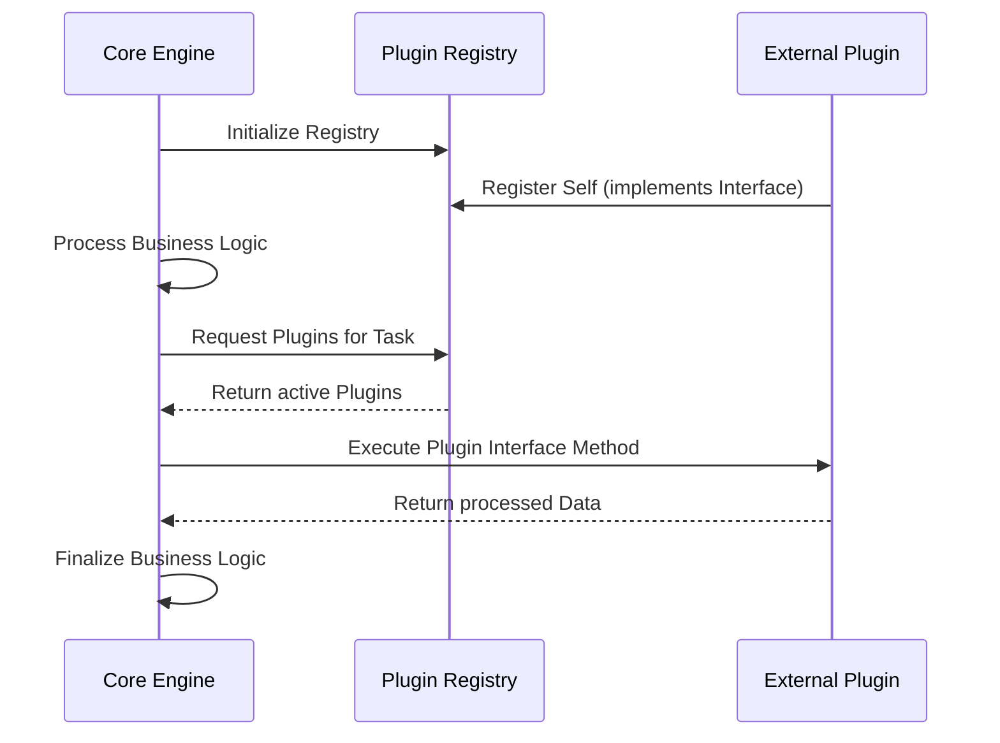

# 🔄 Microkernel Architecture Data Flow Best Practices

  **Core-to-Plugin execution paths and contract enforcement.**

---

## 🔁 The Sequence of Execution

In Microkernel Architecture, the Core dictates the flow, while Plugins provide specialized logic.

## ⛔ Boundary Constraints (Data Flow Rules)

1. **One-Way Dependency:** Plugins MUST depend on Core Interfaces. The Core MUST NEVER depend on Plugin concrete implementations.
2. **Contract Strictness:** Data passed between Core and Plugins MUST adhere to strict, validated DTOs.
