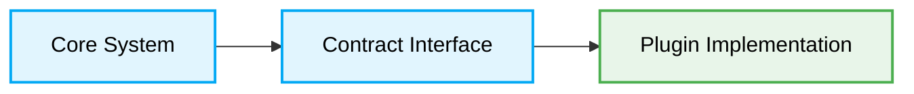

# Data Flow

```mermaid
graph LR
    Core[Core System] --> Interface[Contract Interface]
    Interface --> Plugin[Plugin Implementation]

    classDef default fill:#e1f5fe,stroke:#03a9f4,stroke-width:2px,color:#000;
    classDef component fill:#e8f5e9,stroke:#4caf50,stroke-width:2px,color:#000;

    class Core,Interface default;
    class Plugin component;
```
