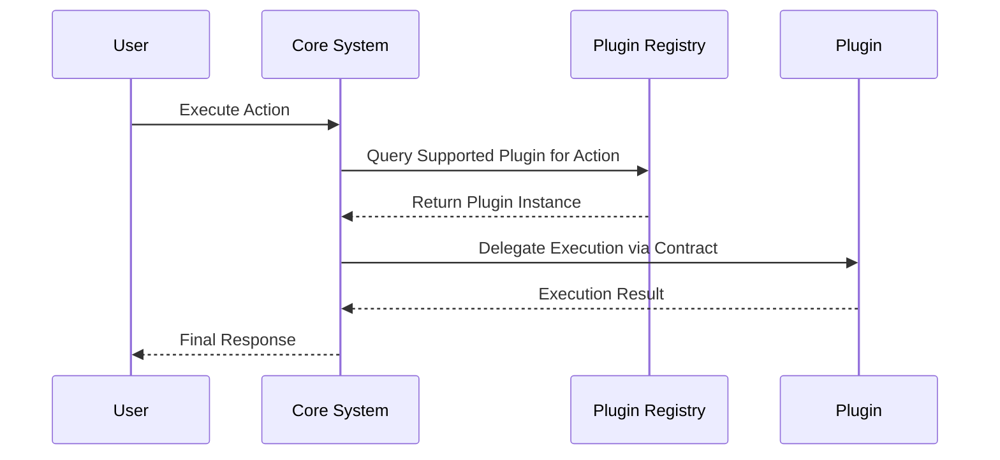

# 🌊 Microkernel Architecture Data Flow

```mermaid
sequenceDiagram
    participant U as User
    participant C as Core System
    participant R as Plugin Registry
    participant P as Plugin

    U->>C: Execute Action
    C->>R: Query Supported Plugin for Action
    R-->>C: Return Plugin Instance
    C->>P: Delegate Execution via Contract
    P-->>C: Execution Result
    C-->>U: Final Response
```
