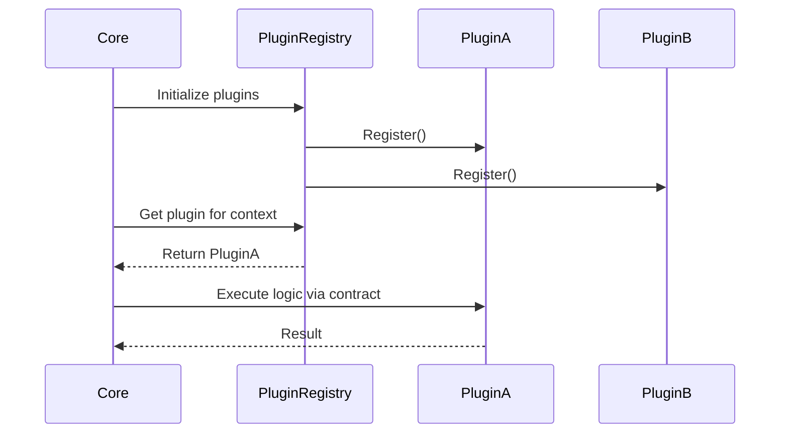

# Microkernel Architecture - Data Flow
## Core-to-Plugin execution paths and contract enforcement

```mermaid
sequenceDiagram
    participant Core
    participant PluginRegistry
    participant PluginA
    participant PluginB

    Core->>PluginRegistry: Initialize plugins
    PluginRegistry->>PluginA: Register()
    PluginRegistry->>PluginB: Register()
    Core->>PluginRegistry: Get plugin for context
    PluginRegistry-->>Core: Return PluginA
    Core->>PluginA: Execute logic via contract
    PluginA-->>Core: Result
```
