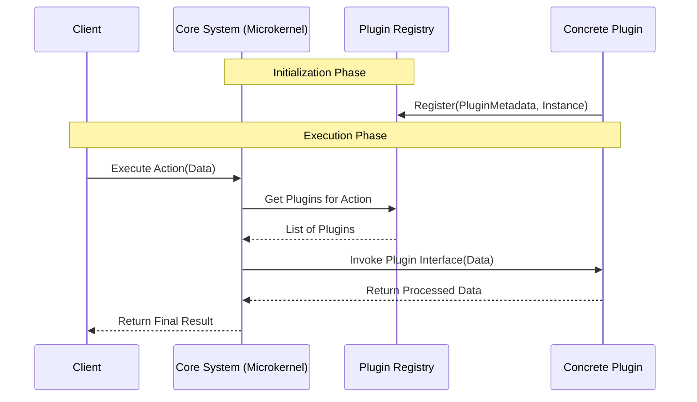

# 🌊 Microkernel Architecture Data Flow

## 🗺️ Map of Patterns (Microkernel Modules)
- 🏠 **[Back to Microkernel Architecture Guidelines](./readme.md)**



## 1. Registry Lookup and Execution

### ❌ Bad Practice
Calling plugins directly from the core using hardcoded imports or evaluating dynamic paths blindly.

### ⚠️ Problem
This couples the core to the specific implementations and bypasses the lifecycle management of the system. If a plugin is missing or fails to load, the core throws unhandled runtime errors.

### ✅ Best Practice
> [!NOTE]
> **Internal Routing:** For more context, refer back to the [Microkernel Architecture Guidelines](./readme.md).

```typescript
interface PluginRegistry {
  getPlugins(type: string): Plugin[];
}

class CoreProcessor {
  constructor(private registry: PluginRegistry) {}

  process(data: any) {
    // Deterministic lookup
    const activePlugins = this.registry.getPlugins('data-processor');

    for (const plugin of activePlugins) {
      // Execute through strict interface
      data = plugin.execute(data);
    }
    return data;
  }
}
```

### 🚀 Solution
Routing all execution through a centralized `PluginRegistry` ensures that the core never knows the concrete types of the plugins. It guarantees safe execution loops, allows plugins to be loaded or unloaded safely at runtime, and keeps the data flow entirely deterministic.
