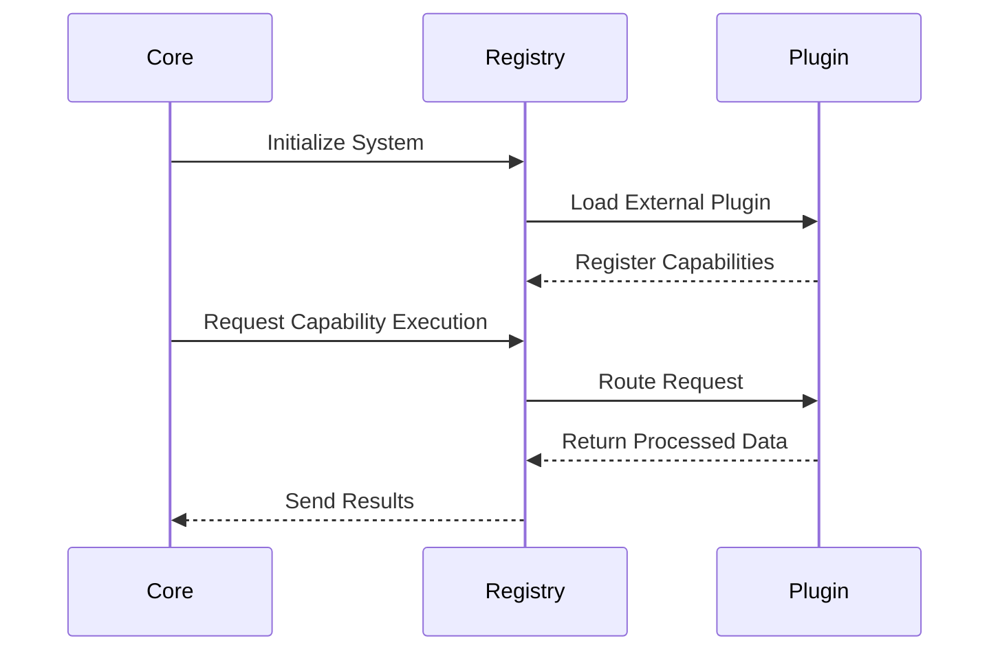

# 🌊 Microkernel Architecture Data Flow

This document details the Core-to-Plugin execution paths.

### ❌ Bad Practice
Directly importing and invoking plugin logic from the core module bypasses the registry pattern, tightly coupling components.

### ⚠️ Problem
If the plugin is removed or modified, the core breaks, violating the Open/Closed Principle.

### ✅ Best Practice
> [!NOTE]
> **Internal Routing:** For more context, refer back to the [Microkernel Architecture Map](./readme.md).

Always use a unified registry to discover and route requests to plugins at runtime.

### 🚀 Solution
Implementing isolated `sequenceDiagram` validated workflows keeps plugins within their boundaries and the core unpolluted.
