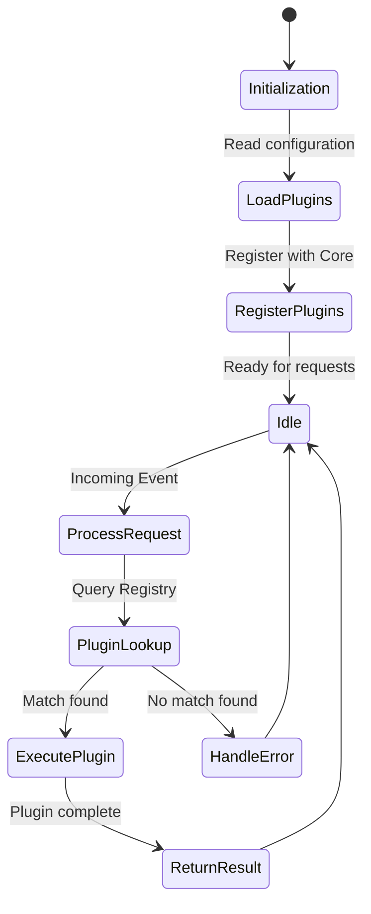

  # 🌊 Microkernel Architecture Data Flow

---

This document describes the request and event lifecycle in a Microkernel Architecture.

## Core-to-Plugin Execution Path

```mermaid
stateDiagram-v2
    [*] --> Initialization
    Initialization --> LoadPlugins : Read configuration
    LoadPlugins --> RegisterPlugins : Register with Core
    RegisterPlugins --> Idle : Ready for requests

    Idle --> ProcessRequest : Incoming Event
    ProcessRequest --> PluginLookup : Query Registry
    PluginLookup --> ExecutePlugin : Match found
    ExecutePlugin --> ReturnResult : Plugin complete
    ReturnResult --> Idle
    PluginLookup --> HandleError : No match found
    HandleError --> Idle
```
