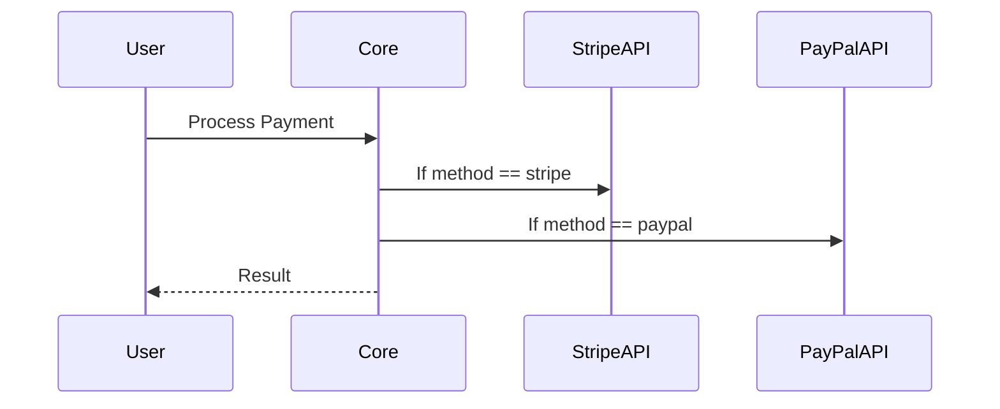
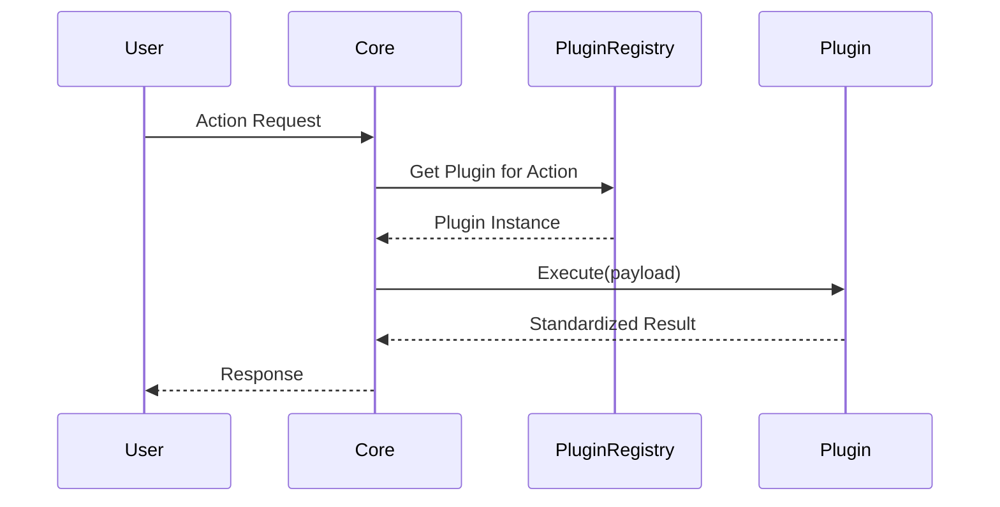

  # 🧩 Microkernel Architecture - Data Flow

---

## ❌ Bad Practice
Directly hardcoding plugin logic inside the core processing flow.

## ⚠️ Problem
Every new plugin requires modifying the core system, violating the Open/Closed principle and risking regressions in fundamental functionality.

## ✅ Best Practice
Data flows strictly through defined interfaces.

## 🚀 Solution
Data passes between the core and plugins solely through standardized Data Transfer Objects (DTOs) and established interfaces. This guarantees O(1) impact on the core logic when registering or unregistering runtime extensions.
