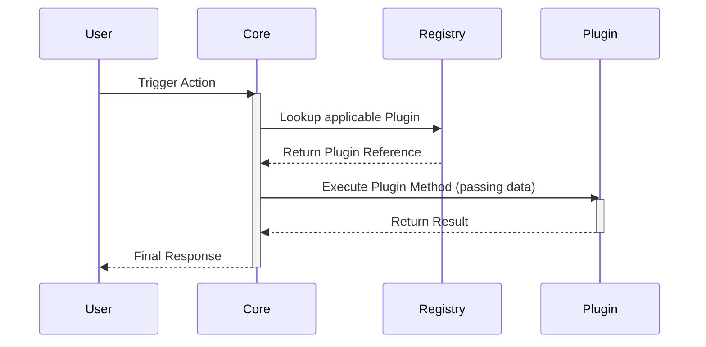

# 🌊 Microkernel Architecture Data Flow

## Request Lifecycle

## Core Principles
1. **Contract Enforcement:** All plugins must strictly adhere to the interfaces defined by the Core.
2. **Registry Lookup:** Execution relies on a dynamic registry mapping at runtime.
