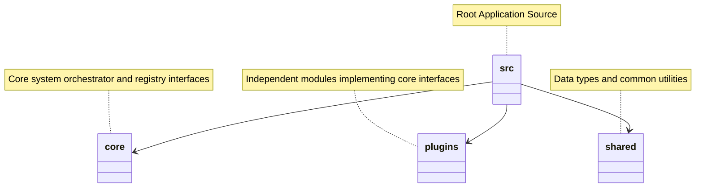

# 📁 Microkernel Architecture Folder Structure

Absolute isolation of the Core engine from volatile Plugins.

### ❌ Bad Practice
Mixing core logic, plugin implementations, and shared utilities inside the same directory.

### ⚠️ Problem
Creates cyclic dependencies and makes it difficult to package the core separately from plugins.

### ✅ Best Practice
> [!NOTE]
> **Internal Routing:** For more context, refer back to the [Microkernel Architecture Map](./readme.md).

Strict separation of concerns by isolating core orchestration, plugins, and shared boundaries.

### 🚀 Solution
A deterministic directory structure ensures that adding or modifying plugins does not touch the core files.
