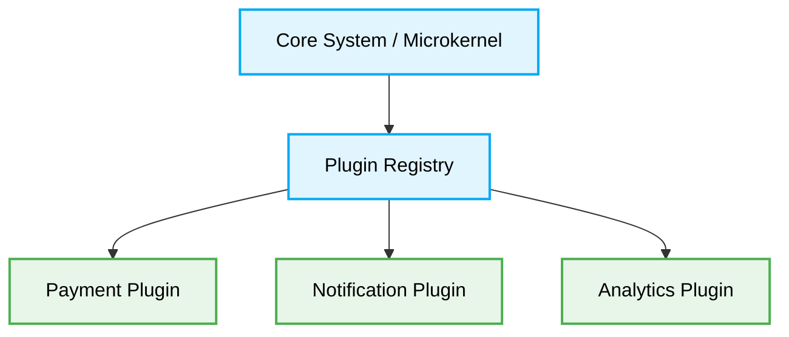

# 📁 Microkernel Architecture Folder Structure



## Directory Blueprint
```text
src/
├── 📁 core/             # Core system orchestrator and registry interfaces
├── 📁 plugins/          # Independent modules implementing core interfaces
└── 📁 shared/           # Data types and common utilities
```
