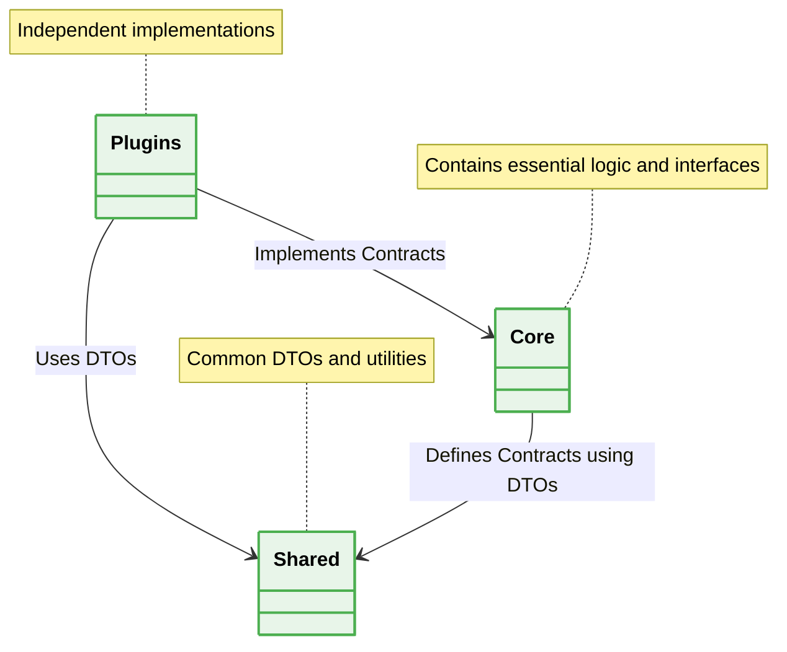

# 📁 Microkernel Architecture Folder Structure

## 🗺️ Map of Patterns (Microkernel Modules)
- 🏠 **[Back to Microkernel Architecture Guidelines](./readme.md)**



## 1. Isolation of Core from Plugins

### ❌ Bad Practice
```typescript
src/
  app/
    core.ts
    plugin-a.ts
    plugin-b.ts // Plugins mixed with core files
```

### ⚠️ Problem
Storing plugins in the same directory as the core engine blurs architectural boundaries. Developers (or AI Agents) might accidentally import a plugin directly into the core, violating the dependency inversion principle.

### ✅ Best Practice
> [!NOTE]
> **Internal Routing:** For more context, refer back to the [Microkernel Architecture Guidelines](./readme.md).

```text
src/
  core/
    interfaces/
      plugin.interface.ts
    registry/
      plugin-registry.ts
    engine.ts
  plugins/
    stripe-payment/
      stripe.plugin.ts
    paypal-payment/
      paypal.plugin.ts
  shared/
    dtos/
      payment.dto.ts
```

### 🚀 Solution
Strictly separating the folder structure physically enforces the architecture. The `core` defines the rules (`interfaces`), the `shared` folder defines the data shapes (`dtos`), and the `plugins` folder simply implements them. This allows plugins to be developed as completely isolated packages (or even separate repositories).
