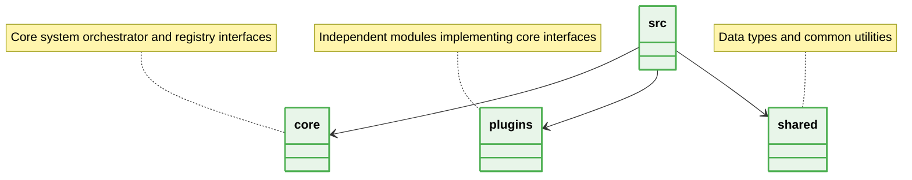

# 📁 Microkernel Architecture Folder Structure Best Practices

  **Absolute isolation of the Core engine from volatile Plugins.**

---

## 🏗️ Structure Rules

## 📌 Core Constraints
1. **Isolated Registries:** The `core/` directory MUST contain the registry logic and interface definitions.
2. **Independent Plugins:** Each plugin in `plugins/` MUST be self-contained and potentially extractable into a separate package.
