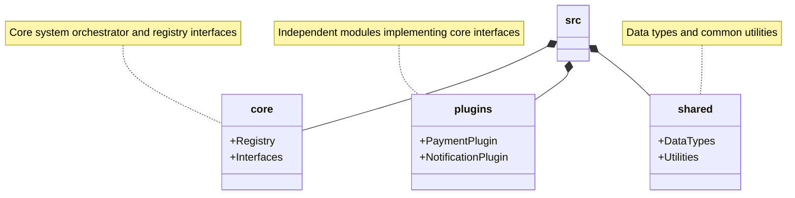

  # 📁 Microkernel Architecture Folder Structure

---

This document outlines the strict directory blueprints for organizing logic within a Microkernel Architecture system.

## Component Relations

```mermaid
classDiagram
    class src {
    }
    class core {
        +Registry
        +Interfaces
    }
    class plugins {
        +PaymentPlugin
        +NotificationPlugin
    }
    class shared {
        +DataTypes
        +Utilities
    }

    src *-- core
    src *-- plugins
    src *-- shared

    note for core "Core system orchestrator and registry interfaces"
    note for plugins "Independent modules implementing core interfaces"
    note for shared "Data types and common utilities"

    %% Design Tokens
    class core:::component
    class plugins:::component
    class shared:::default
```
